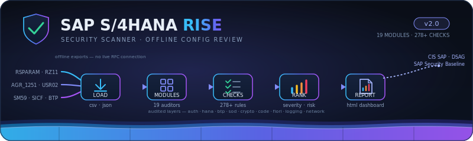

<p align="center">
  
</p>

<p align="center">
  <strong>An offline security audit tool for SAP S/4HANA RISE and BTP environments</strong>
</p>

<p align="center">
  
  
  
  
  
</p>

---

## Overview

**SAP S/4HANA RISE Security Scanner** analyzes exported SAP configuration data (CSV/JSON) and produces an interactive HTML dashboard with findings, severity ratings, and actionable remediation guidance.

- **No direct system connection required** — ideal for RISE environments with restricted RFC access
- **Zero external dependencies** — runs on Python 3.8+ stdlib only
- **CIS SAP Benchmark aligned** — checks mapped to industry-standard baselines
- **67+ security checks** across 5 audit domains

---

## Audit Modules

### 🔐 User & Authorization (`USR-001` → `USR-008`)
| Check | Description | Severity |
|-------|-------------|----------|
| USR-001 | Default users (SAP*, DDIC, SAPCPIC) unlocked | CRITICAL |
| USR-002 | Users assigned SAP_ALL / SAP_NEW / S_A.SYSTEM | CRITICAL |
| USR-003 | Dormant accounts (90+ days inactive) | MEDIUM |
| USR-004 | Service accounts with dialog logon type | HIGH |
| USR-005 | Excessive role assignments per user | MEDIUM |
| USR-006 | Wildcard auth object values (S_DEVELOP, S_TABU_DIS) | HIGH |
| USR-007 | Active accounts that never logged in | LOW |
| USR-008 | Dialog users with stale passwords (180+ days) | MEDIUM |

### 🛡️ Advanced Identity & Access Management (`IAM-*`) — NEW
| Check | Description | Severity |
|-------|-------------|----------|
| IAM-SOD-FIN-001 | SoD: Vendor Master ↔ Payment Processing | CRITICAL |
| IAM-SOD-FIN-002 | SoD: Purchase Order ↔ Goods Receipt | HIGH |
| IAM-SOD-FIN-003 | SoD: Journal Entry ↔ GL Account Master | HIGH |
| IAM-SOD-FIN-004 | SoD: Customer Master ↔ Sales Order / Billing | HIGH |
| IAM-SOD-HR-001 | SoD: HR Master Data ↔ Payroll Execution | CRITICAL |
| IAM-SOD-SEC-001 | SoD: User Admin ↔ Role Admin | CRITICAL |
| IAM-SOD-BASIS-001 | SoD: Transport Mgmt ↔ Development | HIGH |
| IAM-FF-001 | Firefighter sessions exceeding max duration | HIGH |
| IAM-FF-002 | Firefighter sessions without justification | HIGH |
| IAM-FF-003 | Firefighter sessions not reviewed | CRITICAL |
| IAM-FF-004 | Firefighter sessions self-approved | CRITICAL |
| IAM-FF-005 | Users with excessive firefighter usage | MEDIUM |
| IAM-EXP-001 | Role assignments without expiry dates | MEDIUM |
| IAM-EXP-002 | Expired role assignments still present | LOW |
| IAM-EXP-003 | Role assignments with excessive validity | MEDIUM |
| IAM-XID-001 | BTP users without S/4HANA counterpart | MEDIUM |
| IAM-XID-002 | S/4 locked users still active in BTP | HIGH |
| IAM-XID-003 | BTP users with admin role collections | HIGH |
| IAM-REV-001 | Overdue access review campaigns | HIGH |
| IAM-REV-002 | Reviews marked complete but incomplete | MEDIUM |
| IAM-REV-003 | Reviews without assigned reviewer | MEDIUM |
| IAM-ROLE-001 | Custom roles without descriptions | LOW |
| IAM-ROLE-002 | Custom roles without designated owners | MEDIUM |
| IAM-ROLE-003 | Empty roles (no menu/transactions) | LOW |
| IAM-ORPH-001 | Users assigned to deleted/non-existent roles | MEDIUM |
| IAM-USRGRP-001 | Active users in default user groups | LOW |
| IAM-REF-001 | Dialog users misused as reference users | HIGH |
| IAM-PRIV-001 | Users with privilege escalation capability | CRITICAL |

### ⚙️ Security Parameters (`PARAM-*`)
25+ profile parameters validated against the CIS SAP S/4HANA benchmark:
- **Password Policy** — min length, complexity, expiration, history
- **Login Security** — lockout thresholds, SAP* auto-logon, multi-session
- **RFC Security** — `rfc/reject_insecure_logon`, old ticket format
- **Gateway Security** — `gw/sec_info` and `gw/reg_info` configuration
- **Transport Security** — ICM TLS settings, cipher suites
- **Audit Logging** — `rsau/enable`, `rec/client` table logging
- **Development Controls** — debug work processes in production

### 🌐 Network & Service Exposure (`NET-001` → `NET-008`)
| Check | Description | Severity |
|-------|-------------|----------|
| NET-001 | RFC destinations with stored credentials | HIGH |
| NET-002 | RFC destinations to external/unknown hosts | MEDIUM |
| NET-003 | RFC destinations without SNC encryption | HIGH |
| NET-004 | High-risk ICF services active (11 patterns) | HIGH |
| NET-005 | Active ICF services without authentication | CRITICAL |
| NET-006 | Open/unreleased transports in production | MEDIUM |
| NET-007 | Transports with debug/replace indicators | HIGH |
| NET-008 | No active security audit filters (SM19) | CRITICAL |

### ☁️ RISE / BTP-Specific (`RISE-001` → `RISE-007`)
| Check | Description | Severity |
|-------|-------------|----------|
| RISE-001 | Default SAP IDP trust still active | MEDIUM |
| RISE-002 | Automatic shadow user creation enabled | MEDIUM |
| RISE-003 | Communication arrangements with excessive scope | MEDIUM |
| RISE-004 | Communication arrangements with weak/no auth | CRITICAL |
| RISE-005 | Sensitive APIs exposed (finance, HR, master data) | HIGH |
| RISE-006 | Communication users shared across arrangements | MEDIUM |
| RISE-007 | API endpoints with weak/no authentication | HIGH |

---

## Quick Start

```bash
# Clone the repository
git clone https://github.com/Krishcalin/SAP-S4HANA-RISE-Security-Scanner.git
cd SAP-S4HANA-RISE-Security-Scanner

# Run against sample data (included)
python sap_scanner.py --data-dir ./sample_data --output report.html

# Open the report
open report.html        # macOS
xdg-open report.html    # Linux
start report.html       # Windows
```

### CLI Options

```
usage: sap_scanner.py [-h] --data-dir DATA_DIR [--output OUTPUT]
                      [--severity {CRITICAL,HIGH,MEDIUM,LOW,ALL}]
                      [--modules {users,params,network,rise,iam,all} ...]
                      [--config CONFIG]

Options:
  --data-dir   Directory containing exported SAP config files (required)
  --output     Output HTML report filename (default: sap_security_report.html)
  --severity   Minimum severity filter (default: ALL)
  --modules    Specific modules to run (default: all)
  --config     Path to custom baseline JSON overrides
```

### Examples

```bash
# Run only the new IAM module
python sap_scanner.py --data-dir ./exports --modules iam

# Run IAM + user checks together
python sap_scanner.py --data-dir ./exports --modules users iam

# Critical and High findings only
python sap_scanner.py --data-dir ./exports --severity HIGH

# Custom baseline thresholds
python sap_scanner.py --data-dir ./exports --config my_baseline.json
```

---

## Data Sources

<details>
<summary><strong>📋 Click to expand — Full data export guide</strong></summary>

### Core Data
| File | Source | Required Fields |
|------|--------|----------------|
| `users.csv` | RSUSR002 / SU01 | BNAME, USTYP, UFLAG, TRDAT, ERDAT, PWDCHGDATE |
| `profiles.csv` | SU02 / USR04 | BNAME, PROFILE |
| `security_params.csv` | RSPARAM / RZ11 | NAME, VALUE |
| `rfc_destinations.csv` | SM59 | RFCDEST, RFCTYPE, RFCHOST, RFCUSER, RFCSNC |
| `icf_services.csv` | SICF | ICF_NAME, ICF_ACTIVE, AUTH_REQUIRED |
| `audit_config.csv` | SM19 | FILTER_NAME, ACTIVE, EVENT_CLASS |

### BTP / RISE Data
| File | Source | Format |
|------|--------|--------|
| `btp_trust.json` | BTP Cockpit → Security → Trust Config | JSON |
| `comm_arrangements.json` | Fiori "Communication Arrangements" | JSON |
| `api_endpoints.json` | OData service catalog | JSON |
| `btp_users.json` | BTP Cockpit → Users | JSON |

### Advanced IAM Data (New)
| File | Source | Required Fields |
|------|--------|----------------|
| `sod_matrix.csv` | SUIM / GRC ARA export | USERNAME, TCODES |
| `role_tcodes.csv` | AGR_1251 table | AGR_NAME, TCODE |
| `sod_ruleset.json` | Custom SoD rules (optional) | JSON rule definitions |
| `firefighter_log.csv` | GRC SPM / emergency access log | FF_USER, ACTUAL_USER, LOGIN_TIME, LOGOUT_TIME, REASON, REVIEWED, REVIEWER |
| `role_expiry.csv` | AGR_USERS with validity | UNAME, AGR_NAME, FROM_DAT, TO_DAT |
| `user_roles.csv` | AGR_USERS | UNAME, AGR_NAME |
| `role_details.csv` | AGR_DEFINE / PFCG | AGR_NAME, TEXT, OWNER, TYPE, TCODE_COUNT |
| `access_reviews.csv` | GRC ARM / manual tracking | REVIEW_ID, REVIEW_NAME, DUE_DATE, STATUS, COMPLETION_PCT, REVIEWER |

All files are optional — the scanner runs checks only for available data.

</details>

---

## Custom Baseline

Override default thresholds by creating a JSON config file:

```json
{
    "dormant_threshold_days": 60,
    "max_roles_per_user": 20,
    "max_password_age_days": 60,
    "max_role_validity_days": 365,
    "ff_max_duration_hours": 4,
    "ff_max_sessions_per_month": 5,
    "access_review_cycle_days": 90,
    "internal_host_patterns": ["10.", "172.16.", "192.168.", "mycompany.corp"]
}
```

---

## Project Structure

```
SAP-S4HANA-RISE-Security-Scanner/
├── sap_scanner.py              # Main entry point & CLI
├── modules/
│   ├── __init__.py
│   ├── base_auditor.py         # Base class with finding/severity utilities
│   ├── data_loader.py          # CSV/JSON loader with auto-detection
│   ├── user_auth_audit.py      # User & authorization checks (USR-*)
│   ├── iam_advanced.py         # Advanced IAM: SoD, firefighter, role lifecycle (IAM-*)
│   ├── security_params.py      # Profile parameter baseline (PARAM-*)
│   ├── network_services.py     # RFC, ICF, transport, audit log (NET-*)
│   ├── rise_btp_checks.py      # RISE/BTP-specific checks (RISE-*)
│   └── report_generator.py     # HTML dashboard generator
├── sample_data/                # Demo data + sample report
├── docs/
│   ├── banner.svg
│   ├── EXPORT_GUIDE.md
│   └── CHECKS_REFERENCE.md
├── .gitignore
├── LICENSE
├── CONTRIBUTING.md
└── README.md
```

---

## Requirements

- **Python 3.8+**
- **No external packages** — uses only Python standard library

---

## Roadmap

- [x] Core security parameter validation
- [x] User & authorization auditing
- [x] Network & service exposure checks
- [x] RISE/BTP-specific checks
- [x] Segregation of Duties (SoD) conflict detection
- [x] Emergency/firefighter access analysis
- [x] Role lifecycle & expiry management
- [x] Cross-system identity consistency (S/4 ↔ BTP)
- [x] Privilege escalation path detection
- [ ] BTP Cloud Connector audit
- [ ] Data protection & privacy checks (RAL, ILM)
- [ ] Custom ABAP code security scanning
- [ ] Fiori catalog/tile authorization review
- [ ] Cryptographic posture assessment
- [ ] JSON/CSV export alongside HTML report
- [ ] Scan comparison mode (diff two scans over time)
- [ ] CI/CD integration with exit codes

---

## Contributing

Contributions are welcome! See [CONTRIBUTING.md](CONTRIBUTING.md) for guidelines.

## Disclaimer

This tool is for **authorized security assessments only**. Always obtain proper authorization before auditing SAP systems. The scanner performs offline analysis of exported data and does not connect to or modify any SAP system.

## License

This project is licensed under the MIT License — see [LICENSE](LICENSE) for details.
