# MonitorRisk

## How the SAP security scanner is built, explained from first principles

A complete description of the system for readers who are not software engineers — and a grounding in the design decisions for readers who are. No prior knowledge of SAP, security tooling or programming is assumed.

| Field | Value |
|---|---|
| Document | System Architecture Plan — MonitorRisk / SAP-S4HANA-RISE-Security-Scanner |
| Edition | 1.1 · Plain-language edition · figures corrected against the source |
| Author | Krishnendu De |
| Written for | Executives and boards · procurement and audit · SAP functional teams · new joiners · engineers who want the “why” before the “how” |
| Companion | System Architecture Guide (technical edition) |
| Classification | **Confidential.** Not for publication. Circulate only to named recipients under the licence below. |
| Licence | Copyright © 2026 Krishnendu De. All rights reserved. Source-available, not open source. |

## Before you begin — How to read this document

> This document explains a piece of security software from the ground up. It is written so that someone who has never opened a line of code can follow every chapter — and so that someone who writes code for a living still finds the reasoning worth reading.

Everything is explained twice: once in everyday language, using an analogy from ordinary life, and once in the precise terms the system actually uses. Where a technical word is unavoidable, it is introduced in **bold** the first time it appears and defined immediately. [Appendix A](#contents) collects every one of those words in a glossary you can flip to at any point.

There is very little code in these pages. Where a short piece of code appears, it is because seeing the actual instruction makes the idea clearer than describing it would — and each one is walked through line by line afterwards. You can skip every code box and lose nothing essential.

### Four ways through the book

- **An executive or board member** — *You want to know what it does and whether it is sound.* [Part I](#contents) in full (ch. 1–5), then ch. [9](#contents) (the promise the system makes), ch. [22](#contents) (risk in money terms), ch. [23](#contents) (how it avoids overclaiming) and ch. [34](#contents) (its honest limits). About twenty pages.
- **In procurement or audit** — *You are comparing this against alternatives.* Ch. 2–5, then [Part V](#contents) in full (ch. 19–23), ch. [25](#contents) (the gate), ch. [31](#contents) (the tool’s own security posture) and ch. [34](#contents). [Appendix B](#contents) is your feature checklist.
- **An SAP or IT professional** — *You will run it, or read its output.* Everything except [Part VII](#contents). Pay particular attention to ch. [10](#contents)–[13](#contents) (what you have to supply) and ch. [24](#contents)–[28](#contents) (what you get back and how it changes over time).
- **An engineer** — *You will maintain or extend it.* All of it, then the technical companion volume. [Part VII](#contents) and [Appendix E](#contents) are written for you; Parts I–VI will tell you why the code looks the way it does.

### A note on the analogies

Software architecture is invisible. You cannot walk around it, so the only way to describe it is to compare it to something you can walk around. This book uses a small set of recurring comparisons, and it uses them consistently so they build on each other rather than competing:

| The comparison | What it stands for |
|---|---|
| A photograph | An *export* — a still image of how the SAP system was configured at one moment. |
| A safety inspection | A *scan* — a trained inspector walking a building against a checklist. |
| An inspector’s notebook | A *finding* — one written observation, with the location, the problem and what to do. |
| A factory line | The *pipeline* — work moving through stations, each doing one job and passing it on. |
| A locked front door | The *trust boundary* — the line the system will not cross into your SAP estate. |
| A traffic light | The *release gate* — green, red, or “I cannot tell”. |
| A patient’s file | The *finding record* in the database — the same file reopened at every visit rather than a new one each time. |

> **One promise about the writing**
>
>  Nothing in this book is made to sound better than it is. Where the system cannot do something, the chapter says so plainly rather than burying it. Chapter [23](#contents) and chapter [34](#contents) exist entirely for that purpose, and they are as much a part of the architecture as the code is.

## Contents

**Part I · The problem this system exists to solve**

1. **01**[What SAP is, and why it is worth protecting](#contents)
2. **02**[What RISE changed: you no longer own the machine](#contents)
3. **03**[What actually goes wrong inside an SAP system](#contents)
4. **04**[Why ordinary security tools do not fit](#contents)
5. **05**[What MonitorRisk does, in one chapter](#contents)

1. **06**[The whole system on one page](#contents)
2. **07**[The factory line: seven stages](#contents)
3. **08**[Two ways to run it: the briefcase and the control room](#contents)
4. **09**[The line we do not cross](#contents)

1. **10**[What an export actually is](#contents)
2. **11**[Three ways the information arrives](#contents)
3. **12**[Sorting the post: the DataLoader](#contents)
4. **13**[Knowing what you did not see](#contents)

1. **14**[What a check is, with one small piece of code](#contents)
2. **15**[The thirty inspectors](#contents)
3. **16**[Anatomy of a finding](#contents)
4. **17**[When the same setting is right and wrong](#contents)
5. **18**[Reporting the cause, not the symptoms](#contents)

1. **19**[What to fix first](#contents)
2. **20**[Telling people what to actually do](#contents)
3. **21**[Speaking the auditor’s language](#contents)
4. **22**[Putting a number on the risk](#contents)
5. **23**[Saying what we cannot see](#contents)

1. **24**[Three reports, three readers](#contents)
2. **25**[The traffic light: stopping bad changes](#contents)
3. **26**[The control room](#contents)
4. **27**[How a finding recognises itself](#contents)
5. **28**[The five states, and why the fifth matters](#contents)

1. **29**[What it is made of](#contents)
2. **30**[How it is installed and run](#contents)
3. **31**[Securing the security tool](#contents)
4. **32**[How we know it works](#contents)
5. **33**[Adding a new inspector](#contents)
6. **34**[What it cannot do](#contents)
7. **35**[Where it goes next](#contents)

1. **A**[Glossary](#contents)
2. **B**[The thirty modules at a glance](#contents)
3. **C**[What you have to supply](#contents)
4. **D**[Questions people ask](#contents)
5. **E**[Code, annotated](#contents)

---

# Part one · The problem this system exists to solve

Before any description of how something is built, it is worth being clear about what it is for. This part explains what SAP is, what changed when companies moved it to the cloud, what can go wrong inside it, and why the security tools most organisations already own cannot help here.

1. **01**[What SAP is, and why it is worth protecting](#contents)
2. **02**[What RISE changed: you no longer own the machine](#contents)
3. **03**[What actually goes wrong inside an SAP system](#contents)
4. **04**[Why ordinary security tools do not fit](#contents)
5. **05**[What MonitorRisk does, in one chapter](#contents)

## Chapter 01 — What SAP is, and why it is worth protecting

> If a large company were a body, SAP would be its circulatory system. Almost nothing of consequence happens without passing through it.

**SAP** is business software. A single system, running in one place, keeps track of what a company owns, what it owes, what it is owed, who works for it, what it buys, what it sells, and what it pays. When a factory receives a delivery of steel, SAP records it. When that steel is turned into a product and shipped, SAP records that too. When the customer pays, when the supplier invoices, when an employee is hired or given a pay rise — SAP.

The part of SAP that does this is called **S/4HANA**. You will see that name throughout this book; it is simply the current generation of the product. Older companies often still run the previous generation, called **ECC**. Both appear in these pages because MonitorRisk examines both.

### Why this concentration matters

Most computer systems in a company hold one kind of information. The email server holds email. The design software holds drawings. If one of them is compromised, the damage is real but bounded.

SAP is different, and the difference is not one of degree. It holds the ledger, the payment run, the vendor bank details, the payroll, the pricing, the inventory and the customer list — together, in one place, linked. Someone who gains the right access inside SAP is not looking at data. They are standing at the controls.

**FIG. 1.1 — What one SAP system holds**

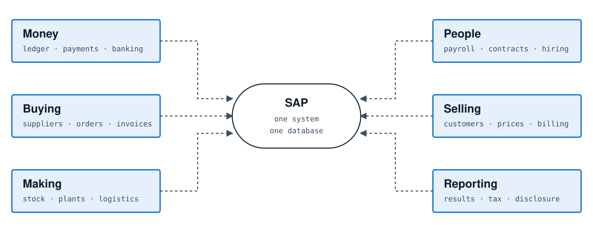

*Six areas of the business, one system. The arrows are not data flows so much as dependencies: each of these functions stops if the centre stops.*

> **A way to picture the stakes**
>
>  A manufacturer’s SAP system goes down on a Monday morning. By ten o’clock the goods-receipt desk cannot book incoming deliveries, so lorries queue at the gate. By noon the production line cannot confirm what it has consumed. Nothing can be despatched, because despatch creates a document in SAP and there is no SAP. No invoice can be raised, so no cash arrives. The company has not lost a database. It has stopped being able to trade.

### The three things worth protecting

Security people talk about three properties, and it is worth naming them once because the rest of this book quietly assumes them:

| Property | What it means for SAP | What its loss looks like |
|---|---|---|
| **Confidentiality** | Only the right people can see the information. | Salaries, prices or customer data leaked. |
| **Integrity** | The information is true, and changes to it are made only by those entitled to make them, with a record. | A payment redirected. A ledger quietly altered. Accounts that cannot be relied on. |
| **Availability** | The system is there when the business needs it. | The Monday morning above. |

Of the three, integrity is the one that most often gets under-weighted and most often causes the worst outcomes. A leak is embarrassing and expensive. An outage is painful and public. But a company that cannot prove its own numbers are true has lost something harder to buy back — and quiet integrity failures are precisely what weak configuration inside SAP permits.

### Why regulators care too

Because SAP holds the ledger, it sits directly in the path of financial reporting rules. In many countries a listed company must demonstrate that the controls around its accounting system work — that the person who creates a supplier cannot also pay that supplier, for example. Those demonstrations are made to auditors, annually, in writing. A great deal of what MonitorRisk checks is not “hacker” security at all; it is whether those business controls are actually configured the way the company has told its auditors they are.

> **Take-away from this chapter**
>
>  SAP concentrates the entire operating and financial reality of a company into one system. That concentration is what makes it efficient, and it is exactly what makes its configuration worth inspecting carefully and repeatedly.

## Chapter 02 — What RISE changed: you no longer own the machine

> For thirty years, a company that ran SAP ran it on its own computers, in its own building, administered by its own staff. That arrangement is ending, and the change is the single most important fact about the system described in this book.

### The old world

In the traditional arrangement — usually called **on-premise**, meaning “on the premises” — the company owned everything. The physical servers sat in a room the company rented or owned. The company’s own administrators had the highest level of access. If they wanted to install a piece of software inside SAP to inspect it, they installed it. If they wanted to read a technical setting, they read it. Nobody’s permission was required.

### The new world

**RISE with SAP** is SAP’s offering in which SAP itself runs the system for the customer. The servers belong to SAP or to a cloud provider SAP contracts with. SAP’s staff perform the technical administration. The customer still owns the data and still decides how the business runs — but the customer no longer has the keys to the machine room.

You will meet a few variants in these pages. **PCE** (Private Cloud Edition) is the common one, where the customer gets a dedicated system that SAP operates. **ECS** (Enterprise Cloud Services) is SAP’s name for the operating organisation behind it. Some customers run their older ECC system inside the same arrangement. The differences matter in chapter [17](#contents); for now, treat them all as “SAP runs it, not you”.

**FIG. 2.1 — The same system, two different sets of keys**

**Traditional — on-premise** — You own the building
  - Servers and network — **yours**
  - Operating system access — **yours**
  - Technical settings — **yours to change**
  - Business configuration — **yours**

**RISE with SAP** — SAP owns the building
  - Servers and network — **SAP’s**
  - Operating system access — **SAP’s**
  - Technical settings — **you see, SAP changes**
  - Business configuration — **still yours**

*The bottom row is unchanged in both columns — which is why so many of the risks in chapter 3 remain entirely the customer’s problem.*

### Three consequences that shape everything

#### 1. You cannot install anything

Most SAP security products work by installing a component *inside* the SAP system — in SAP terms, an **add-on** written in SAP’s own programming language. Under RISE, installing a third-party add-on is what SAP calls an *Excluded Task*. It is not forbidden outright, but it sits outside the standard service: it requires a separate purchase, an evaluation by SAP, and typically weeks of elapsed time. Many customers simply never get there.

#### 2. You cannot get the technical account you would want

The other common approach is to give the security tool a login with wide read access, so it can interrogate the system directly. Under RISE, obtaining such an account — with the privileges that would make it useful — ranges from difficult to impossible, and rightly so: SAP is accountable for the platform and is cautious about who holds powerful credentials on it.

#### 3. You still carry the risk

This is the part that surprises people. SAP operates the platform, but the customer remains responsible for who has which permissions, whether the person creating suppliers can also pay them, whether an interface is exposed to the internet, and whether custom code written by the customer’s developers is safe. Under most regulations the customer, not SAP, answers to the auditor.

> **The gap this creates**
>
>  The customer holds the accountability but has lost the access. That gap — real responsibility without the old means of inspection — is the space MonitorRisk was designed to occupy.

### The shared-responsibility idea

Cloud contracts describe this split as **shared responsibility**. It is a sound principle, and it has a practical sting: when a security weakness is found, the first question is no longer “how do we fix it” but “whose is it to fix”. A report that lists a problem the customer cannot possibly resolve is worse than useless — it wastes the reader’s time and teaches them to distrust the rest of the list.

This is why, in chapter [16](#contents), you will see that every finding MonitorRisk produces carries an owner: either the customer, who can act today, or SAP, in which case the system drafts the service request for them rather than issuing an instruction nobody can follow.

> **Take-away from this chapter**
>
>  RISE removed the customer’s ability to inspect their own SAP system from the inside, without removing their responsibility for what is inside it. Every major design decision in this book follows from that one sentence.

## Chapter 03 — What actually goes wrong inside an SAP system

> Security failures in SAP are rarely dramatic. They are almost always mundane — a setting left at its factory default, a permission granted for a project that ended two years ago, an account nobody remembered to close.

This chapter walks through the six families of problem the system looks for. You do not need to remember the names; you need the shape, because [Part IV](#contents) is organised around exactly these families.

### Family 1 — Doors left unlocked

SAP ships with built-in accounts, much as a new router ships with a default password. The most famous is called `SAP*`; there are several others with names like `DDIC` and `EARLYWATCH`. Their default passwords are published in SAP’s own documentation and are known to everyone in the field, attackers included.

Closing them is basic hygiene, and it is missed constantly — usually because a system was copied from another system, or restored from a backup, or built years ago by people who have since left.

> **Why it survives**
>
>  A test system is built as a copy of production. Somebody unlocks a standard account to fix a problem during the build and forgets to lock it again. Two years later that test system is quietly connected to production so that transports can flow between them. The unlocked door is now on the path to the crown jewels, and no single person ever made a bad decision.

### Family 2 — Too many keys

In SAP, what a person can do is decided by **authorisations** bundled into **roles**. In principle each person receives only what their job requires. In practice roles accumulate: a person moves department and keeps the old role, a project grants temporary access that is never withdrawn, an administrator solves an urgent problem by granting something broad because it is faster than working out what is precisely needed.

The extreme case has a name every SAP person knows: `SAP_ALL`, a profile that grants essentially everything. It exists for legitimate emergency use. It is found on ordinary user accounts far more often than anyone would like.

### Family 3 — One person holding both halves

Some combinations of permission are dangerous not individually but together. If one person can create a supplier record *and* approve payments to suppliers, that person can invent a company and pay it. Neither permission is wrong on its own; the combination removes the second pair of eyes.

The discipline of keeping such pairs apart is called **Segregation of Duties**, almost always shortened to **SoD**. It is the single most examined control in financial audit, and it is genuinely hard to check by hand: a company with 8,000 users and 1,200 roles has millions of combinations to consider.

**FIG. 3.1 — Segregation of duties: harmless apart, dangerous together**

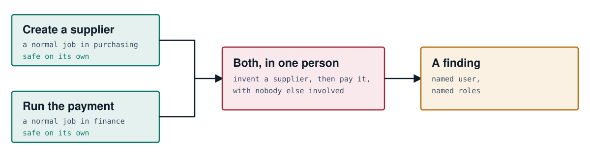

*MonitorRisk evaluates these combinations at the level of what a permission actually allows, not merely which screens a role mentions — the distinction is explained in chapter 15.*

### Family 4 — Windows left open to the outside

A modern SAP system does not sit alone. It publishes **interfaces** so that other systems can talk to it: a web shop sends orders in, a bank receives payment files, a mobile app reads stock levels. Each of these is a door with a purpose.

The failures here are of a familiar kind. A door opened for a project that was cancelled and never closed. A door that accepts anyone who knocks, because authentication was going to be added later. A door that carries data unencrypted, so anyone on the network path can read it. A door whose permitted callers are listed as “anyone”, because the person configuring it could not find out which addresses were legitimate.

### Family 5 — Missing repairs

SAP publishes security corrections monthly. The most severe are branded **HotNews**. Some of the vulnerabilities they fix are, in the plainest terms, remotely exploitable without a password — an attacker who can reach the system over a network can take control of it.

Applying these corrections requires planning and downtime, so they queue. The gap between publication and application is where most genuinely serious SAP incidents live. Several such flaws appear on the United States government’s catalogue of vulnerabilities known to be actively used by attackers; a system missing one of those is not theoretically at risk.

### Family 6 — Home-made code

Nearly every company writes its own additions to SAP, in SAP’s programming language, **ABAP**. This is normal and often essential. It is also the least reviewed code in the building: written under time pressure, frequently by contractors, rarely security-tested, and running with the full authority of the system.

The classic defects are old and well understood — a program that builds a database query out of whatever the user typed, a password written directly into the source, a program that never checks whether the person running it is allowed to. They persist because nobody looks.

**FIG. 3.2 — The six families, and roughly how often they appear**

1. **Doors left unlocked** — default and standard accounts

*Red marks the families that most often produce a critical finding on a first scan. None of the six requires an attacker to be sophisticated; all of them require somebody to have looked.*

> **Take-away from this chapter**
>
>  The problem is not exotic. It is accumulated drift: settings, permissions and doors that were each reasonable when created and were never revisited. Finding drift is a job of patient, exhaustive comparison — which is precisely the sort of job software is better at than people.

## Chapter 04 — Why ordinary security tools do not fit

> Most organisations already own several security products. It is a fair question why none of them answers the SAP problem. The answer is that they are looking at a different layer of the building.

### The layers of a computer system

Think of a running business system as a set of floors stacked on each other. The lower floors are generic — they look much the same at any company. The upper floors are specific to the business.

**FIG. 4.1 — Where existing tools look, and where the SAP risk lives**

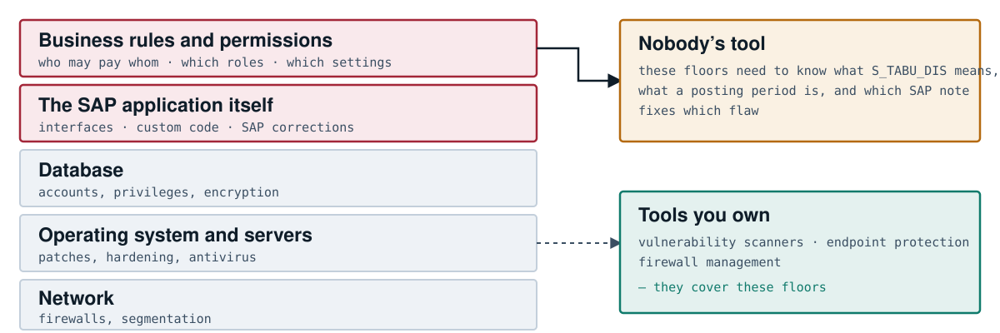

### Why the gap is not laziness

A general vulnerability scanner works by recognising software versions and known flaws. That is a perfectly good technique for the lower floors, where the software is standard. On the upper floors there is no version to recognise. The question is not “which release is this” but “should this particular person hold this particular permission in this particular company” — and answering it requires knowing SAP’s own vocabulary in depth.

That vocabulary is large, idiosyncratic and forty years old. Knowing that an authorisation object called `S_RFCACL` with a wildcard value effectively allows someone to log in as anybody from a connected system is not general security knowledge. It is SAP knowledge, and it takes years to acquire.

### The four approaches, and where each stops

| Approach | How it works | Where it stops |
|---|---|---|
| **General vulnerability scanner** | Probes the network, matches software versions against known flaws. | Sees the servers, not the business rules. Cannot evaluate a permission. |
| **Log monitoring / SIEM** | Collects events as they happen and alerts on patterns. | Only sees what SAP was configured to record. If audit logging is switched off — itself a common finding — there is nothing to collect. |
| **SAP add-on products** | Install a component inside SAP; deep and capable. | Installation is an Excluded Task under RISE, with the cost and delay described in chapter 2. |
| **Manual audit** | An experienced consultant pulls extracts and reviews them. | Excellent and unrepeatable: expensive, slow, and a photograph of one week that is out of date by the next quarter. |

### The shape of the gap

Putting those together produces a fairly precise specification for something that does not exist in most organisations: a tool that has deep SAP knowledge, needs nothing installed in the SAP system, needs no powerful account, can be run repeatedly rather than annually, and produces something an engineer, an auditor and a board member can each use.

> **Take-away from this chapter**
>
>  The tools most companies own are looking at the right building on the wrong floors. The SAP risk lives on the floors where business meaning is required — and reaching those floors without installing anything is the design problem MonitorRisk solves.

## Chapter 05 — What MonitorRisk does, in one chapter

> If you read nothing else, read this. Everything after it is elaboration.

### The idea in three sentences

Somebody takes a set of photographs of how the SAP system is currently configured — lists of users, roles, settings, connections, and so on — and saves them as ordinary files. MonitorRisk reads those files on a computer that has no connection to SAP at all, and applies **673 checks** written by people who know SAP well. It produces a report that says what is wrong, how bad it is, what to do about it, who is able to do it, and what it is worth in money.

**FIG. 5.1 — The whole idea**

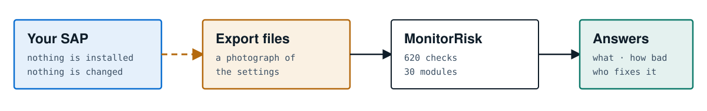

### The seven questions it answers

A useful way to understand any security product is to ask which questions it can answer. This one answers seven, and they are deliberately in this order:

|  | Question | How it is answered |
|---|---|---|
| 1 | **What is wrong?** | 673 checks across 33 subject areas produce a list of findings, each naming the specific accounts, roles, settings or connections involved. |
| 2 | **How bad is each one?** | A severity from Critical to Low, assigned by the check itself according to what an attacker could achieve. |
| 3 | **What should we do first?** | A priority from P1 to P4 that combines severity with whether the flaw is known to be exploited, how exposed it is, and how much privilege it confers. |
| 4 | **What exactly do we do?** | A numbered remediation procedure naming the specific SAP transaction, parameter or table to change, how to verify it worked, and what to be careful of. |
| 5 | **Who can do it?** | Each finding is marked as the customer’s to fix, or SAP’s — in which case the report drafts the service request. |
| 6 | **What does the auditor need?** | Every finding is mapped to the control frameworks auditors work from, so the same evidence answers eight different questionnaires. |
| 7 | **What is it worth?** | Optionally, the findings are translated into an expected annual financial loss using an established risk-quantification method. |

### What it deliberately does not do

An honest summary needs the other half. MonitorRisk does not watch your system. It does not sit between users and SAP. It does not block anything, alert in real time, or detect an attack in progress. It reads a photograph and tells you what the photograph shows.

That limitation is a choice, not an omission, and it is what allows the tool to work in RISE at all. Chapter [23](#contents) describes how the product states this limit on its own screens rather than in the small print, and chapter [34](#contents) lists every other constraint without softening.

> **The one-sentence version**
>
>  MonitorRisk is a very thorough, very knowledgeable safety inspection of an SAP system that can be carried out entirely from outside it — and repeated as often as you like.

### Who uses it, and for what

| Reader | What they take from it |
|---|---|
| SAP Basis team | The fix list, in priority order, with exact instructions. |
| Security team | The overall posture, the trend across scans, the exposure. |
| Internal audit | Evidence mapped to control frameworks; segregation-of-duties results. |
| The CISO and the board | A short deck and a financial exposure figure. |
| A change pipeline | A pass or fail signal that stops a change making things worse. |

> **Take-away from Part I**
>
>  SAP concentrates the business (ch. 1). Moving it to RISE removed the customer’s ability to inspect it while leaving them responsible for it (ch. 2). What goes wrong is mundane, cumulative drift (ch. 3). Existing tools look at the wrong layer (ch. 4). MonitorRisk closes that gap by reading an export rather than touching the system (ch. 5).

---

# Part two · The shape of the system

Now that the problem is clear, this part describes the solution’s overall form: what the pieces are, how work moves between them, the two ways the system can be run, and the one promise that constrains every other decision.

1. **06**[The whole system on one page](#contents)
2. **07**[The factory line: seven stages](#contents)
3. **08**[Two ways to run it: the briefcase and the control room](#contents)
4. **09**[The line we do not cross](#contents)

## Chapter 06 — The whole system on one page

> Architects draw a “context diagram” before anything else: a picture of the thing in the middle, everything it talks to, and nothing about its insides. Here is ours.

**FIG. 6.1 — MonitorRisk in context**

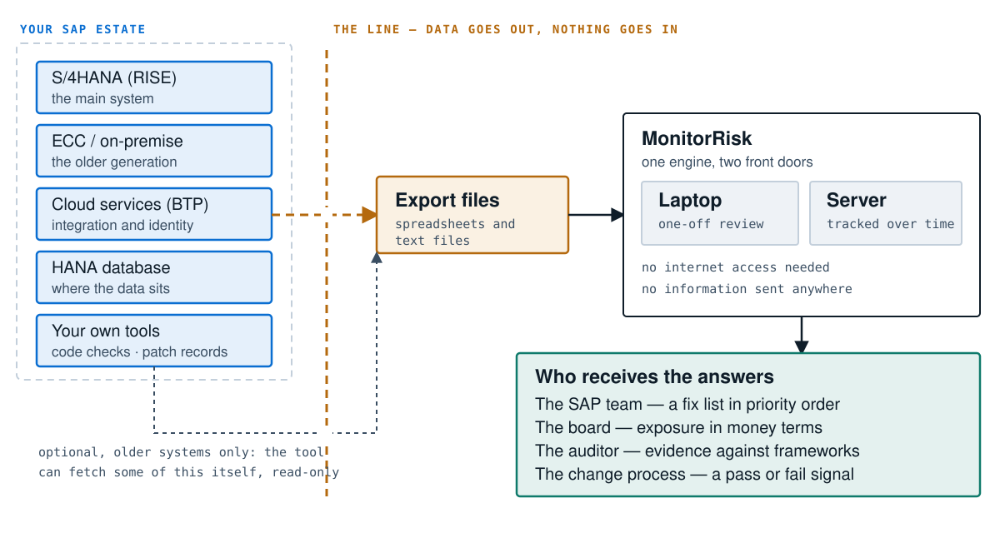

*The dashed amber line is the most important element on the page. Information crosses it in one direction only. Chapter 9 explains what that guarantee is worth and how it is enforced rather than merely promised.*

### Reading the diagram

**On the left** is your estate — the systems being examined. Note that this is a plural: a modern SAP landscape is several systems that talk to each other, and a weakness in the least important one is often the route into the most important one.

**In the middle** is the export: a folder of ordinary files. This is the only thing that leaves your SAP systems, and a human being can open every one of them and see exactly what is in it. There is no proprietary format and no hidden channel.

**On the right** is MonitorRisk itself, which can be run in either of two ways (chapter [8](#contents)) but is the same engine underneath. It needs no connection to your SAP systems, no connection to the internet, and no connection to the vendor.

**At the bottom** are the people and processes that consume the output. One scan serves all of them, which matters more than it sounds: when the engineer’s list and the board’s figure come from two different tools, they eventually disagree, and the ensuing argument is about the tools rather than the risk.

### What is deliberately absent

| Absent | Why that matters |
|---|---|
| Any component inside SAP | No add-on to install, so no Excluded Task, no extra licence, no multi-week evaluation. |
| A privileged SAP account | Nothing to request, nothing to protect, nothing to misuse. |
| An outbound connection to the vendor | Your configuration data never leaves your control. There is no telemetry. |
| A permanent agent on a server | Nothing running continuously means nothing to patch, monitor or explain to a change board. |

> **Take-away from this chapter**
>
>  The system’s context is unusually simple: files in, answers out, no live connection anywhere. Most of the engineering effort described in the rest of this book goes into making that simple shape genuinely sufficient.

## Chapter 07 — The factory line: seven stages

> Inside, the system is arranged like a production line. Work enters at one end, passes through seven stations, and leaves at the other. Each station does one job and hands the result to the next. No station reaches back.

**FIG. 7.1 — The seven stages**

1. **LOAD** — open every export file and put its contents in memory

### Why a line, and not a cloud of components

The arrangement is old-fashioned on purpose. Each stage takes what the previous stage produced, does one thing, and passes it on; nothing loops back. That has three practical benefits that matter more than elegance:

- **You can reason about it.** If the output is wrong, the fault is at one station, and you can inspect what entered and left it.
- **You can test each station alone.** Give station three a known input and check its output. No SAP system required — a point chapter [32](#contents) returns to.
- **Nothing has hidden state.** The same input produces the same output every time. For a tool whose output may be shown to an auditor, that reproducibility is not a nicety.

### The stages, one by one

#### Stage 1 — LOAD

Reads the folder of export files and turns each into structured information in memory. It never fails because a file is missing; a missing file simply means the information is not available, which is recorded rather than treated as an error. Chapters [12](#contents) and [13](#contents) explain why that distinction matters so much.

#### Stage 2 — INSPECT

Thirty modules run, each an expert in one subject: one knows about user accounts, one about the HANA database, one about cloud connections, one about custom code. Each is handed the same body of information and takes what it needs.

#### Stage 3 — CHECK

Within each module sit individual rules — 673 in total. Each rule asks one question and, if the answer is unsatisfactory, writes one finding. A finding is a small record, not a sentence: it names the objects involved, so later stages can work with it mechanically.

#### Stage 4 — RANK

Findings arrive unordered. This stage sorts them into what to do first, using more than severity alone (chapter [19](#contents)).

#### Stage 5 — MAP

Each finding is associated with the specific clauses of eight external control frameworks that it bears on, so one scan answers many questionnaires (chapter [21](#contents)).

#### Stage 6 — QUANTIFY

Optional. Converts the whole picture into a financial exposure using a recognised method (chapter [22](#contents)). It is optional because it requires figures only the customer can supply, and the system refuses to invent them.

#### Stage 7 — REPORT or STORE

Either produce documents — a web page, a formal PDF, a slide deck — or write everything into a database so that this scan can be compared with the last one. This fork is the subject of chapter [8](#contents).

> **One subtlety worth noting now**
>
>  A user can ask the system to display only serious findings. That filter applies to what is *printed* and to nothing else. The financial figure, the audit mapping, the summary counts and the pass/fail signal are all computed from the complete set. A display setting that quietly changed a verdict would make every number in the document unsafe to rely on. Chapter [19](#contents) returns to this; it is one of the design rules the code enforces explicitly.

## Chapter 08 — Two ways to run it: the briefcase and the control room

> The same engine can be used in two quite different ways, answering two different questions. Choosing between them is the first decision a customer makes.

### The briefcase

The first way is a program run from a command line on a laptop. You point it at a folder of export files; a minute or two later you have a report. Nothing is installed, nothing persists, and the laptop needs no network connection of any kind — it can be run inside a secure room with no internet.

This mode answers: *what is wrong today?*

### The control room

The second way is a small web application the organisation installs once. People sign in with a browser, upload an export, and the scan runs automatically. The results are stored in a database, so the next upload can be compared with the last.

This mode answers: *are we getting better?* — which the briefcase genuinely cannot, because it forgets everything the moment it finishes.

**FIG. 8.1 — The same engine, two front doors**

**The briefcase** — Command line on a laptop
  - Input — a folder of files
  - Output — web page, PDF, slides
  - Memory — none, single shot
  - Install — nothing at all
  - Network — none required
  - Best for: a first assessment, an air-gapped room, a due-diligence review, a change pipeline.

**The control room** — A small web application
  - Input — browser upload
  - Output — a live console and an API
  - Memory — a database, kept
  - Install — one app, one database
  - Network — internal only
  - Best for: tracking remediation, assigning owners, proving progress to an auditor over quarters.

### Why the engine is shared and not duplicated

It would have been easier to build the web version separately. It would also have been a serious mistake. Two copies of 673 security rules drift apart: a rule is improved in one and not the other, and eventually the laptop and the console disagree about the same system on the same day. When that happens, the customer stops trusting both.

So the web application does not re-implement a single check. It calls the same engine. The briefcase and the control room can differ in what they remember and how they present things; they cannot differ about what is true.

### What the control room adds

| Capability | Why it needs a memory |
|---|---|
| **The mitigation journey** | Classifying each finding as new, still present, fixed, come back, or not examined this time. Meaningless without a previous scan to compare against. |
| **Ownership and dates** | Assigning a finding to a person with a due date, and measuring how long fixes actually take. |
| **Accepted risks** | Recording a decision to live with something — with an expiry date, so it returns for review rather than disappearing. |
| **Disputes** | Marking something as a false alarm, with a written reason, so the argument is recorded once rather than repeated each quarter. |
| **Handed to SAP** | A distinct state for work raised with SAP under RISE and waiting on them — neither open nor fixed. |
| **Object map** | Turning the named accounts, roles and connections into a linked map, the groundwork for showing attack paths through the estate. |

> **Take-away from this chapter**
>
>  Start with the briefcase to find out where you stand; move to the control room when the question changes from “what is wrong” to “are we fixing it”. Because they share one engine, moving between them changes what you can remember, never what you are told.

## Chapter 09 — The line we do not cross

> Every security product asks a customer for trust. This chapter is about the specific promise this one makes, and — more importantly — about the difference between a promise and a guarantee.

> **The promise, stated plainly**
>
>  Nothing is ever installed inside your SAP system. No technical account is created for the scanner. Nothing is ever written back into SAP. The analysis engine **connects to nothing** — it has no ability to open a network connection of any kind.

### Why the last sentence is the interesting one

The first three claims are the sort of thing any vendor can put in a brochure. The fourth is different in kind, and the difference is worth dwelling on, because it is the clearest example in this book of an architectural decision made for trust rather than for convenience.

Some customers do want the tool to collect data itself, at least for older systems that are not in RISE. That capability exists. The obvious way to build it would have been to add a “connect to this system” option to the scanner. That option was refused. Instead, collection lives in a *completely separate program* that writes exactly the same kind of files a human would have exported by hand. The scanner then reads those files and cannot tell how they were produced.

**FIG. 9.1 — Why separation is stronger than a setting**

**The easy design — rejected** — One program, a connect option
  - The scanner *contains* the ability to reach your systems.
  - “It only reads” becomes a claim about behaviour — which means a bug, or a future change, can break it silently.

**The chosen design** — Two programs, one direction
  - The scanner contains *no* ability to reach anything.
  - “It cannot connect” becomes a property you can verify by inspection — there is no code that could do it.

*The distinction is the difference between “we do not do that” and “we cannot do that”. Only the second survives a change of staff, a rushed release, or a determined reviewer.*

### Read-only, enforced rather than intended

The separate collector, where it is used, faces a related problem. The SAP service it talks to in order to read settings is the same service that can start, stop and restart the system, and run commands on the underlying machine. Being careful not to call those is a policy; policies fail.

Instead, the collector holds a list of the specific read operations it is permitted to perform, and that list is checked *before the request is even assembled*. A mistake in the calling code cannot reach a destructive operation, because the destructive operation never gets as far as being constructed.

### Passwords are never typed on the command line

A small detail that says a good deal about the general attitude. There is no option to pass a password as part of the command. On a shared machine, anything typed as part of a command is visible to other users while it runs and is stored in the shell’s history afterwards. So the password is either prompted for, piped in from a secrets tool, or read from an environment variable — never typed where it will be recorded.

### Partial by design, and honest about it

The collector cannot obtain everything. Some of the most valuable information — the full detail of users, roles and permissions — is only reachable through an SAP interface the product deliberately declines to use, because using it would require exactly the kind of privileged account this whole design exists to avoid.

Rather than hiding that, every collection run writes a manifest naming what it could not reach. A partial collection is therefore visibly partial, and chapter [13](#contents) shows how that same honesty runs through the whole product.

> **Take-away from Part II**
>
>  The system is a straight line: files in, seven stations, answers out (ch. 6–7). It runs either as a self-contained program or as a small web application sharing the identical engine (ch. 8). And its central promise is structural rather than behavioural: the scanner cannot reach your systems, because it contains nothing that could (ch. 9).

---

# Part three · Getting the information in

The system is only ever as good as what it is given. This part explains what an export actually is, the three routes by which information arrives, how it is sorted on the way in, and — most importantly — how the system keeps track of what it was never shown.

1. **10**[What an export actually is](#contents)
2. **11**[Three ways the information arrives](#contents)
3. **12**[Sorting the post: the DataLoader](#contents)
4. **13**[Knowing what you did not see](#contents)

## Chapter 10 — What an export actually is

> The word “export” does a lot of work in this book, so it deserves a chapter. An export is not a copy of your business data. It is a copy of your *settings*.

### The distinction that matters

SAP contains two very different kinds of information. There is the business data — the actual invoices, the actual salaries, the actual customer orders. And there is the configuration — the list of who has which permission, which password rules apply, which connections exist, which services are switched on.

MonitorRisk reads the second kind almost exclusively. It wants to know that a user called `MHOFFMAN` holds a role that permits creating suppliers; it has no interest in which suppliers were created, or what was paid to them.

**FIG. 10.1 — What is exported, and what is not**

**Exported — configuration**
  - the list of user accounts and their status
  - which roles each account holds
  - what each role permits
  - password and login settings
  - connections to other systems
  - which services are switched on
  - which SAP corrections are applied

**Not exported — business data**
  - invoices, payments, ledger entries
  - salaries and personal records
  - customer and supplier details
  - prices and contracts
  - stock and production records
  - The scanner has no rule that reads any of this, and no place to put it.

*A useful sentence for a data-protection review: the export describes the locks, not the contents of the safe.*

### What the files look like

They are ordinary files of two kinds. Most are **CSV** — comma-separated values, the format a spreadsheet saves when you ask for plain text. The rest are **JSON**, a text format that can express nested structure, used for the cloud services whose settings are not a simple table.

Both are readable. If you open one in a text editor you see exactly what the scanner sees. This is worth stating because it removes a whole category of anxiety: there is no opaque bundle, no encrypted blob, nothing you have to take on faith.

```python
# the beginning of a typical users.csv — one row per account
BNAME,USTYP,UFLAG,TRDAT,GLTGB,CLASS
MHOFFMAN,A,0,20260731,,FINANCE
BATCH_MM,B,0,20260814,,TECHNICAL
J_PATEL,A,64,20240119,,SALES

# in plain words, column by column:
#   BNAME   the account name
#   USTYP   the kind of account: A = a person, B = a background job
#   UFLAG   lock status: 0 = unlocked, 64 = locked by an administrator
#   TRDAT   the date this account last logged in
#   GLTGB   the date the account expires — blank means never
#   CLASS   the group the account belongs to
```

Three rows, and already several of the questions from chapter 3 can be asked. Is `J_PATEL` locked but still holding roles? `TRDAT` says the account has not logged in since January 2024 — is it dormant? `BATCH_MM` is a background account: does it hold permissions no automated job should have?

### How many files, and does it matter if some are missing?

The full catalogue runs to **128 logical sources** ([Appendix C](#contents) lists them). Almost nobody supplies all of them on a first run, and that is expected. Every file is optional: the system runs whatever checks it has the information for and records the rest as not assessed.

What is *not* acceptable is for a partial export to produce a clean-looking report. That is the whole subject of chapter [13](#contents).

### How the export is produced

In SAP, the person doing this runs a series of standard reports and transactions — built-in ones, present on every system, that display information on screen and offer to save it to a file. The names look cryptic (`RSUSR002`, `SUIM`, `RSPARAM`, `SM59`) and are simply the addresses of standard screens. Nothing is installed to do this, and the person needs only display access.

> **How long it takes in practice**
>
>  A first export, done by someone who knows the system and is following the export guide, takes roughly half a day for the core files and perhaps a day if the cloud and database extracts are included. Once the steps are written down for a particular landscape, repeating it takes an hour or two, and much of it can be scheduled. That repeatability is what makes quarterly — or monthly — scanning realistic in a way that a manual audit never is.

> **Take-away from this chapter**
>
>  An export is a readable photograph of your settings, not your data. It is produced with built-in SAP screens by someone with display access, it is entirely optional file by file, and you can inspect every byte of it before it goes anywhere.

## Chapter 11 — Three ways the information arrives

> Three quite different routes feed the same engine. The important architectural fact is that they converge before any checking begins — which is why the system cannot behave differently depending on where its information came from.

**FIG. 11.1 — Three routes, one meeting point**

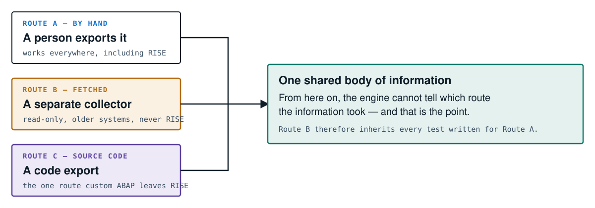

### Route A — a person exports it

The default, and the only one available for RISE systems. Somebody with display access runs the standard screens and saves the results. It requires no special software, no network permission, and no negotiation with SAP.

### Route B — a separate collector fetches it

For older systems that the organisation still runs itself, and that are reachable over the internal network, a separate small program can gather some of the information automatically. It can read the system’s technical settings and can survey which web services are switched on — including, usefully, which of them answer without asking for a password at all.

This route is optional, is never used for RISE, and — as chapter [9](#contents) explained — lives in a different program from the scanner, so that “the scanner does not connect to anything” remains true by construction.

> **A deliberate omission in Route B**
>
>  The richest information — full user, role and permission detail — is only available through an SAP interface that requires a powerful account. The product declines to use it. That means Route B is incomplete by design, and every collection run says so in writing. An honest partial answer is worth more than a complete answer that required a key nobody should have handed over.

### Route C — a source-code export

Custom ABAP code cannot be read from a RISE system by ordinary means; there is no file access and no shell. There is, however, one well-established open-source tool used across the SAP world to package code into a portable archive for version control. That archive is the route.

When the customer supplies one, a further module unpacks it and analyses the code itself, applying **135 rules** for the classic weaknesses described in chapter 3, family 6.

### Why convergence matters more than it sounds

Because all three routes produce the same shape of information, none of the 673 checks contains any logic about provenance. There is no “if this came from the collector, be more careful” branch anywhere. Adding Route B required no changes to the checking logic at all, and required no new tests of the checks, because the checks could not tell the difference.

This is a general principle worth naming, since it recurs later in the book: **push variation to the edges**. Let the outside of the system deal with the messy diversity of the real world, and let the middle see one clean, uniform thing.

> **Take-away from this chapter**
>
>  Three routes in, one shape of information, and a hard rule that nothing downstream may know or care which route was taken. Complexity is absorbed at the boundary rather than spread through the engine.

## Chapter 12 — Sorting the post: the DataLoader

> One small component turns a folder of files into organised information. It is worth a chapter because of one unusual design decision inside it.

### The job

The component is called the **DataLoader**. Picture a post room. Envelopes arrive with different names on them; the post room knows which department each name belongs to and puts it in the right pigeonhole. Later, anybody who needs the purchasing post goes to the purchasing pigeonhole rather than rummaging through the pile.

The DataLoader holds a table matching each expected filename to a named slot. When it finds `users.csv`, it reads it and places the contents in the slot called `users`. When a module later asks for `users`, it gets exactly that.

**FIG. 12.1 — Files in, named slots out**

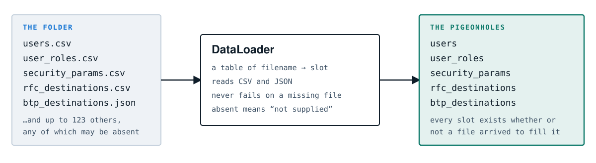

### The unusual decision: absence is normal

In most software, asking for something that is not there is an error. Here it is not. If `ral_config.csv` was never supplied, the slot called `ral_config` exists and is empty, and every check that needs it quietly stands aside.

This is the only sensible behaviour when nobody ever supplies all 128 sources — but it creates a serious danger, which the next chapter is entirely about. A system that skips silently produces a short, clean report and looks like good news.

> **The trap, stated once so you recognise it later**
>
>  Fewer findings can mean a healthier system, or it can mean you supplied fewer files. Those two situations look identical unless the system is built to tell them apart — and they lead to opposite decisions.

### One special case

Almost everything the DataLoader handles is a file. The source-code export of Route C is a *folder* instead, so it does not go through the filename table; it is placed directly into a slot of its own. A small irregularity, mentioned here because it is the sort of thing that confuses a new engineer reading the code for the first time, and because it illustrates a broader habit: where something genuinely does not fit the pattern, the code says so rather than distorting the pattern to accommodate it.

### Why one shared body of information

All thirty modules read from the same set of slots. They do not each open files. That has two consequences worth knowing:

- A file is read once, no matter how many modules need it. With large exports — a permission extract can run to millions of rows — that is the difference between a scan taking a minute and taking an hour.
- Every module sees identical information. Two modules cannot reach different conclusions because one of them read a stale copy.

> **Take-away from this chapter**
>
>  The DataLoader is a post room: filenames in, named slots out, missing post recorded rather than treated as a crisis. Its permissiveness is necessary and dangerous in equal measure, which is why the next chapter exists.

## Chapter 13 — Knowing what you did not see

> This is the most important chapter in Part III, and possibly the most important short idea in the book. A security report that does not say what it could not examine is not merely incomplete — it is misleading in the specific direction that causes harm.

### The failure mode

Imagine a building inspector who is given access to three floors of a ten-storey building. She inspects the three thoroughly, finds two minor issues, and writes a report headed “Inspection Report” listing two minor issues. Everything in it is true. The owner reads it and concludes the building is sound.

Nothing in that report is a lie. It is nonetheless the most dangerous document she could have produced, and the fault is not in what it says but in what it fails to say about its own scope.

**FIG. 13.1 — Two reports with the same findings, telling opposite stories**

**Without a coverage statement** — “12 findings. 2 critical.”
  - The reader concludes: not bad.
  - In truth 21 of 33 subject areas were never examined, because the files they need were not supplied. Every sentence is accurate. The document is still false.

**With a coverage statement** — “12 findings. 2 critical.”
  - “You supplied 41 of 128 sources.”
  - “21 areas were not assessed.”
  - “1 source cannot be obtained in RISE at all.”
  - The reader concludes: we have looked at a third of the building.

### The coverage manifest

Once per scan, the system builds a small record — the **coverage manifest** — that answers, in numbers:

- How many of the known sources were supplied, out of how many exist.
- How many modules ran with everything they wanted.
- How many modules ran but were missing part of their input, so their answer is partial.
- How many modules had nothing at all to work with and did not run.
- Which sources are not obtainable in this kind of deployment at all — a genuinely different situation from “you forgot”.

That record is computed once and carried into every artefact the scan produces. It appears on the web page, in the PDF, in the slide deck, and in the database. There is no version of the output that omits it.

> **The rule this enforces**
>
>  The system may never imply completeness it does not have. Where it has not looked, it says so — in the same document, at the same prominence as the findings themselves. **Missing input is a finding, not a silence.**

### Three distinct kinds of “no”

A great deal of clarity comes from refusing to collapse three different situations into one:

| Situation | What it means | What the reader should do |
|---|---|---|
| **Checked, nothing found** | We looked properly and this area is in good order. | Nothing. Genuine good news. |
| **Not supplied** | The information was never given to us, so we could not look. | Supply it next time. Treat the area as unknown, not as safe. |
| **Not obtainable** | This cannot be extracted from this kind of system at all. | Accept a permanent blind spot, and cover it another way. |

Most reporting tools show the first and second identically, as a green tick or an empty section. That single conflation is responsible for a great deal of misplaced confidence in the security industry.

### It also affects the pass/fail signal

Chapter [25](#contents) describes a mode in which the system gives a change process a simple verdict. Degraded coverage does not produce a pass there. It produces a distinct third answer meaning “I could not assess this” — because a build that could not be checked must never look like a build that was checked and found clean.

> **Take-away from Part III**
>
>  An export is a readable photograph of settings, not data (ch. 10). Three routes deliver it and converge into one shape (ch. 11). A post room sorts it and treats absence as normal (ch. 12). And because absence is normal, the system counts and publishes exactly what it never saw (ch. 13).

---

# Part four · Doing the checking

This is the heart of the system: what a check actually is, who the thirty inspectors are, what they produce, and two design principles that separate a scanner people trust from one they switch off.

1. **14**[What a check is, with one small piece of code](#contents)
2. **15**[The thirty inspectors](#contents)
3. **16**[Anatomy of a finding](#contents)
4. **17**[When the same setting is right and wrong](#contents)
5. **18**[Reporting the cause, not the symptoms](#contents)

## Chapter 14 — What a check is, with one small piece of code

> People imagine security scanning as something arcane. At the level of a single check it is almost disappointingly simple: look at some information, ask one question, and write a note if the answer is unsatisfactory.

### One check in English

> **Check USR-002, stated plainly**
>
>  “Go through the list of user accounts. For each one, look at when it last logged in. If it has not logged in for more than ninety days and it is not locked, write it down as a dormant account that is still open.”

That is the whole of it. The intelligence is not in the mechanism — it is in knowing that dormant accounts matter, that ninety days is a defensible threshold, that locked ones should be excluded, and that background accounts must be treated differently because they may legitimately never “log in” in the ordinary sense. Those judgements come from experience; the code is a few lines.

### The same check as code

Here it is in the language the system is written in. You do not need to be able to write this — only to see that it says what the paragraph above says.

```python
# Check USR-002 — accounts that are dormant but still open

DORMANT_DAYS = 90                       # the threshold, overridable per customer

for account in self.data["users"]:      # every row of users.csv

    if account["UFLAG"] != "0":         # 0 means unlocked
        continue                        # locked already: nothing to report

    days_idle = days_since(account["TRDAT"])   # TRDAT = last logon date

    if days_idle > DORMANT_DAYS:
        self.finding(
            check_id = "USR-002",
            severity = "MEDIUM",
            objects  = [account["BNAME"]],     # name the actual account
            evidence = f"no logon for {days_idle} days",
        )
```

### Line by line

| The code says | Which means |
|---|---|
| DORMANT_DAYS = 90 | Ninety days is the default. A customer can override it — a business with seasonal staff may choose one hundred and eighty. |
| for account in self.data["users"] | Take each row from the `users` pigeonhole the DataLoader filled. If that pigeonhole is empty, this loop does nothing and the check quietly stands aside. |
| if account["UFLAG"] != "0":   continue | Skip anything already locked. Reporting a locked account as a risk would be noise, and noise is how a scanner loses its audience. |
| days_idle = days_since(…) | Work out how long since the last logon. |
| self.finding(…) | Write one note. Note that it records the *account name* and the concrete evidence — never a vague statement. Chapter [27](#contents) shows why naming objects is what makes tracking over time possible. |

### Why 673 of these are hard

If one check is fifteen lines, 673 checks are not simply nine thousand lines of the same thing. The difficulty is elsewhere:

- **Knowing what to check.** Most of the value is the accumulated knowledge of which settings matter and why. A cryptic permission with a wildcard value can mean “may impersonate any user from a trusted system”. Knowing that is decades of SAP experience, not programming.
- **Knowing when not to fire.** A check that reports something harmless trains the reader to ignore it. The single most common cause of a security tool being abandoned is false alarms.
- **Context changing the answer.** The same value can be correct in one kind of system and wrong in another — chapter [17](#contents).
- **Not fragmenting one problem.** Ten symptoms of one cause should be one finding — chapter [18](#contents).
- **Handling missing and malformed input.** Real exports have blank columns, odd encodings and truncated rows. Every check must survive them without crashing and without inventing.

### Checks are grouped into families

Each check has an identifier: `USR-002` above. The prefix is its family, and the family tells you which module produced it and what it concerns. You will see `AUTH-` for permission analysis, `BTP-` for cloud services, `CRYPTO-` for encryption, `HOTNEWS-` for missing corrections. The identifiers are stable, which is what makes it possible to say “we fixed USR-002 last quarter” and be understood.

> **Take-away from this chapter**
>
>  A check is a small, readable question asked of one piece of information. The engineering is ordinary; the expertise is in which questions to ask, and in the discipline not to ask ones whose answers will be ignored.

## Chapter 15 — The thirty inspectors

> Checks are grouped into thirty modules, each an expert in one subject. Think of a building inspection carried out by thirty specialists — one for wiring, one for fire doors, one for the lift — rather than one generalist with a very long clipboard.

### Why thirty and not one

The separation is not cosmetic. It buys four things:

- **You can run one alone.** If today’s question is only about the database, run only that module and get an answer in seconds.
- **You can test one alone.** Feed the cloud module a crafted cloud export and check every one of its rules fires. No SAP system involved.
- **You can extend one alone.** Adding a check to permissions cannot break encryption checking, because they share nothing but the input.
- **You can staff it.** The person who knows HANA deeply need not also know cloud integration.

**FIG. 15.1 — The thirty modules, grouped by what they know about**

**Who can do what**
  - user accounts
  - advanced identity
  - permission analysis
  - duty separation
  - access governance
  - role design quality
  - business roles

**How it is hardened**
  - security settings
  - baseline settings
  - secure communication
  - cloud mandatory config
  - encryption posture
  - database security
  - system trust

**What is exposed**
  - network services
  - cloud core
  - cloud attack surface
  - integration layer
  - the app interface
  - jobs and commands
  - missing corrections

**Code, data, assurance**
  - custom code scan
  - SAP’s own code results
  - code and transports
  - code inventory
  - data protection
  - logging and monitoring
  - log review · finance

*What every module has in common: it receives the same shared information and does not open files itself; it owns a check-ID family no other module may use; it stands aside when its input was not supplied — and says so; it returns a plain list of findings, printing nothing and deciding nothing; and it can be run entirely on its own against test data with no SAP system. Appendix B lists all thirty by name.*

### Three modules worth understanding in detail

#### Duty separation — the module that does arithmetic nobody can do by hand

Chapter 3 introduced segregation of duties. Doing it properly is harder than it looks, and the difference between a shallow and a deep implementation is the difference between a report an auditor accepts and one they dismiss.

A shallow check asks: does this user hold a role whose name suggests supplier maintenance, and another whose name suggests payments? That produces false alarms constantly, because role names lie and because a role may grant only the ability to *view* suppliers, not create them.

The deep version resolves, for every user, what each of their roles actually permits — down to the level of the specific action allowed on the specific object. A conflict is reported only when the user genuinely holds the ability to *change* on both sides. Someone with view-only access on one side is not a conflict, and reporting them as one is exactly the noise that gets a tool switched off.

The module ships with **27 defined risks** across purchasing, sales, accounting, HR and technical administration, and it honours documented compensating controls: if the business has an approved control with an expiry date covering a particular user and risk, the conflict is reported as residual rather than open.

#### Custom code — the module that reads your programs

This one is unusual because it does not read a table; it reads source code, and reading source code properly is a different discipline.

The naive approach searches for suspicious text line by line. It fails in both directions, because in ABAP a single instruction routinely spans five lines and ends with a full stop rather than a line break. Searching line by line therefore misses real problems that are spread across lines and invents problems from fragments that look alarming out of context.

So the module first breaks the code into complete instructions the way the SAP compiler would, then follows how untrusted values travel through the program — a technique called **taint analysis**. That lets it distinguish between a program that builds a database query from whatever the user typed, and one that builds a query from a value it validated three lines earlier.

Findings are graded rather than asserted: *confirmed*, *tentative*, or *pattern only*. Telling the reader how sure the machine is respects their time.

#### Missing corrections — the module that is mostly a curated list

This one compares the list of SAP corrections you have applied against a built-in catalogue of the significant security notes published since 2020, including several whose flaws are on the United States government’s list of vulnerabilities known to be under active attack.

Almost all the value here is in the catalogue’s accuracy, and the design reflects that: the catalogue is data, verified once, rather than logic scattered through code. If you supply no list of applied corrections at all, the module does not stay silent — it raises a finding saying that patch status is unknown, which is itself a governance problem worth naming.

### Modules that defer to each other

In two places in the system, a module deliberately stands down in favour of a better one.

Where a customer already licenses SAP’s own code-analysis product, its results are imported and used instead of re-deriving them. Those findings come from SAP’s tool, running inside the customer’s own system; duplicating them would only produce disagreements with SAP about SAP’s own product.

Similarly, the older, coarser duty-separation logic stands down when the deep permission-level module is running. Notably, it stands down only when that module is *actually running in this scan* — an earlier version deferred whenever the deep module’s input file merely existed, with the result that asking for only the coarse module produced no duty-separation findings at all. A small bug with a large blast radius, and a good illustration of why the composition point of the system knows which modules are running.

> **Take-away from this chapter**
>
>  Thirty specialists, each owning a subject and a family of check identifiers, each independently runnable and testable, all reading the same shared information and none of them printing anything. The depth is in individual modules; the discipline is in what they all have in common.

## Chapter 16 — Anatomy of a finding

> Everything the system produces is made of one repeated unit. Understanding that unit explains why the reports, the tracking and the money figure are all possible from a single scan.

### A finding is a record, not a sentence

When a check fires it does not write prose. It fills in a small structured record — the equivalent of a form with labelled boxes. Prose is generated much later, by the report writer, from the record. That separation is what allows the same finding to appear as a line in a table, a slide, a database row and an input to a financial model without being rewritten each time.

**FIG. 16.1 — The parts of one finding**

| Field | What it holds, and why |
|---|---|
| check_id | **AUTH-002** — unique in the whole system, stable over time, so “we fixed AUTH-002” means one thing to everyone. |
| severity | **CRITICAL** — how bad it is if exploited. Set by the check, not by the reader. |
| description | “Role permits logon as any user from a trusted system” — one plain sentence, always a sentence, never a fragment. |
| objects | **Z_BASIS_SUPPORT · 14 named users** — the concrete things involved. The key to everything in chapter 27. |
| owner | **customer** — or **ticket_to_sap**. Decides whether this reads as an instruction or a service request. |
| coverage flag | “I could not see everything here” — set when a check ran on partial input. Feeds chapters 13 and 25. |

*Narrative and remediation are **not** stored here. They are looked up later from the knowledge base (ch. 20).*

### Why the objects field is the important one

A finding that says “some roles have excessive permissions” is nearly useless. A finding that says “role `Z_BASIS_SUPPORT` permits impersonation, and these fourteen named people hold it” can be acted on this morning.

It also has a consequence nobody expects on first reading: because the finding names concrete objects, the system can recognise the same finding again in next quarter’s scan even though the scan is a completely fresh run over completely fresh files. That recognition is what makes tracking, ageing and time-to-fix measurement real rather than approximate. Chapter [27](#contents) is devoted to it.

### Why the owner field exists

Chapter 2 explained that under RISE some things are simply not the customer’s to change. A report that tells an SAP Basis administrator to change a setting they have no ability to change does two kinds of damage: it wastes their afternoon, and it teaches them that the tool does not understand their world.

So each finding is marked — **a finding must know who can fix it**. Where the owner is SAP, the report does not issue an instruction; it produces a drafted service request describing the change, ready to be raised. The work is the same; the framing is the difference between a tool that fits the operating model and one that fights it.

### What is deliberately not in the record

The long explanation of why something is dangerous, and the step-by-step instructions for fixing it, are not stored in the finding. They live in a separate knowledge base, looked up by check identifier when a report is written (chapter [20](#contents)). Two reasons:

- The same finding may appear five hundred times in one scan — once per affected role. Storing a page of narrative five hundred times would be wasteful and would make the record awkward to move around.
- Improving the guidance for 673 checks becomes an edit to a content file rather than a change to thirty programs, which means it can be done by the person who knows SAP best rather than the person who writes code best.

> **Take-away from this chapter**
>
>  One small, uniform record with a stable identity, a severity, the concrete objects involved, an owner, and an honesty flag. Every report, every trend line and every financial figure in this book is assembled from that one shape.

## Chapter 17 — When the same setting is right and wrong

> Here is the design decision that most separates this system from a generic checklist, and it takes a moment to accept because it sounds like a contradiction.

> **The uncomfortable fact**
>
>  There are technical settings in SAP that are a serious weakness on a system a company runs itself, and are *mandatory* — required by SAP, on every system, without exception — on a system SAP runs under RISE.

### How that can possibly be true

It is not a contradiction; it is a difference in what surrounds the setting. Consider one real example, an option that controls whether the system will accept a connection from the SAP desktop client that is not encrypted.

On a company-run system, encryption between the desktop and the server is something the company controls end to end, and accepting unencrypted connections means passwords and business data crossing the office network in the clear. It is a proper finding.

In SAP’s cloud service, the encryption is provided by a different layer of the platform, which SAP operates and guarantees. Requiring it again at this level would break the connection method SAP has standardised on. SAP’s own hardening requirement therefore specifies the setting the other way — and it is not optional.

**FIG. 17.1 — One setting, two verdicts**

**A company-run system** — This is a finding
  - Nothing else guarantees encryption on the path, so credentials and business data cross the network unprotected.
  - Severity: high.

**A RISE system** — This is compliant
  - SAP’s own mandatory hardening requires this value.
  - Flagging it would raise a false alarm on every correctly configured system.

*The export says *accept unencrypted* — exactly the same value in both systems. Only the context differs.*

### Why getting this wrong is fatal to trust

Imagine the alternative. A scanner that does not know the difference is run against a properly configured RISE system and reports a high-severity finding on a setting SAP mandates. The customer raises it with SAP. SAP replies that the setting is required and cannot be changed. The customer now knows the tool does not understand the platform it claims to specialise in — and quite reasonably discounts everything else it said.

This is not an edge case. There are three such settings in the mandatory baseline, and every compliant RISE system in the world has all three.

### How the system handles it

Whoever runs the scan states which kind of estate the export came from — a company-run system, a private cloud system, a tailored one, or an older ECC system running inside the cloud service. That single statement is built once, at the start of the run, and handed to every module that needs it.

Building it once, in one place, is deliberate. If each module worked out for itself which estate it was looking at, two modules would eventually disagree, and a report in which the encryption module believes it is examining a cloud system while the account module believes it is examining an on-premise one is worse than no report.

> **The default is the strict one**
>
>  If nobody says, the system assumes a company-run estate — the setting under which those three values *are* findings. Guessing “cloud” would silently relax three genuine weaknesses on a system that has them. The system would rather raise a question you can answer than hide one you cannot see.

### Completeness against the mandatory baseline

SAP publishes its cloud hardening requirements as a formal note containing 92 technical parameters plus a set of configuration items that are not parameters. The system covers all 92, and every one of the configuration items is accounted for in a table naming who owns it.

Two details of how that was implemented say a lot about the intended standard of care:

- **The values are read from a recorded extract of SAP’s note, not typed in by hand.** A single transcription error would tell a customer they are compliant when they are not — the worst possible failure for a compliance tool, because it is silent and it is confidently wrong.
- **If SAP publishes a new version adding a nineteenth configuration item, the build breaks.** The system is arranged so that an unaccounted-for item fails the automated build rather than quietly producing a report with a hole in it. Better a broken build for the vendor than a false assurance for the customer.

> **Take-away from this chapter**
>
>  “Compliant” is not a property of a setting. It is a property of a setting *in a context*. The system takes the context as an explicit input, defaults to the strict interpretation, and covers the platform owner’s own mandatory baseline completely rather than approximately.

## Chapter 18 — Reporting the cause, not the symptoms

> A second principle, as important as the first and easier to explain: when ten observations all follow from one underlying fact, the report should contain one problem, not ten.

### The example

SAP has a subsystem for securing communication between systems, governed by eighteen related settings. One of those settings is the master switch. The other seventeen describe how the mechanism should behave — which algorithms, what minimum protection, whether to accept weaker connections, and so on.

Now consider a system where the master switch is off. Evaluate the eighteen settings independently and you produce roughly ten findings: this option is weak, that one is permissive, another is at its default. Every one of them is technically accurate. Every one of them is also irrelevant, because when the mechanism is switched off none of its options does anything at all.

**FIG. 18.1 — Ten findings, or one**

**Checking each setting alone** — Ten problems reported
  - weak protection level
  - insecure connections accepted
  - library path not set
  - identity not configured
  - minimum below recommended
  - …and five more
  - The reader starts fixing option four. None of it will change anything, because the mechanism is switched off.

**Modelling the whole mechanism** — Secure communication is off · One problem reported
  - One finding. Critical.
  - The seventeen options are listed as context, not as separate problems, because they take effect only once the mechanism is turned on.
  - The reader fixes the thing that matters.

### Why this is an architectural matter and not an editorial one

It would be possible to produce ten findings and then hide nine of them at print time. That is not what happens, and the difference matters. The module evaluates the eighteen settings as a single state — a model of the mechanism — and emits findings about the mechanism’s state. There are never ten findings to suppress.

That distinction shows up in three places downstream. The count is honest: the summary does not say “ten issues” when there is one. The financial model is not given ten pieces of evidence when there is one fact. And the fix-first ordering is not distorted by one problem occupying ten slots in the queue.

### Relationships, not just values

Modelling the mechanism also allows the system to check things no individual setting could express — relationships that SAP’s own documentation states but that no single value can enforce:

- Two settings that must name the same identity, and are silently useless if they diverge.
- Two settings that must point at the same software library.
- A minimum protection level that must not exceed the maximum — a configuration that is internally contradictory and will behave unpredictably.

Each of these is invisible if you check settings one at a time, because each individual value is perfectly reasonable. Only the combination is wrong.

> **A general lesson for anyone specifying a checking tool**
>
>  Counting is not the same as understanding. A tool that reports 400 findings where a knowledgeable human would report 60 is not four hundred times more thorough — it is six times noisier, and the reader will eventually stop opening the report. The measure of a good scanner is not how much it says; it is how much of what it says is worth acting on.

> **Take-away from Part IV**
>
>  A check is a small, readable question (ch. 14). Thirty specialists ask them, each owning a subject (ch. 15). Each answer becomes a small uniform record naming concrete objects (ch. 16). Context decides whether a value is a fault (ch. 17). And one cause produces one finding, not ten symptoms (ch. 18).

---

# Part five · Making sense of the results

673 checks against a real estate can produce thousands of findings. An undifferentiated list of thousands of problems is not information; it is a way of guaranteeing that nothing gets fixed. This part is about turning the list into decisions.

1. **19**[What to fix first](#contents)
2. **20**[Telling people what to actually do](#contents)
3. **21**[Speaking the auditor’s language](#contents)
4. **22**[Putting a number on the risk](#contents)
5. **23**[Saying what we cannot see](#contents)

## Chapter 19 — What to fix first

> Severity alone is a poor guide to action. Two findings can both be marked critical and be worlds apart in urgency.

### Why severity is not enough

Severity answers one question: how bad would it be if this were exploited? It says nothing about whether anyone is currently exploiting it, whether it is reachable from outside the company, or how much power it hands over.

Consider two critical findings. The first is a missing correction for a flaw that is on the public list of vulnerabilities known to be actively used by attackers, on a system reachable from the internet. The second is a permission held by two administrators on a development system that has no external connectivity. Both are “critical”. Only one of them should interrupt someone’s afternoon.

**FIG. 19.1 — How the fix-first order is built**

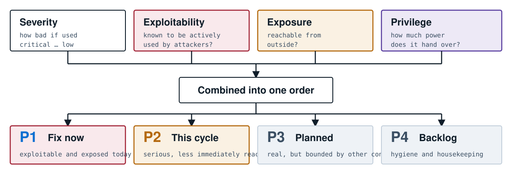

### Why not use the industry’s standard score?

There is a widely used scoring system for software vulnerabilities. It works well for its purpose — rating a flaw in a piece of software — and it cannot rate most of what this system finds. There is no published score for “this named person can create suppliers and also pay them”, because that is not a software flaw at all. It is a fact about one organisation’s configuration.

So the prioritiser scores things the standard cannot, and it shows the reader which factors contributed. A ranking that cannot be interrogated is a ranking that gets argued with.

### The rule about filtering, made concrete

A reader can ask the report to show only high-severity findings. This is a common and reasonable request. It changes what is printed, and nothing else — **a display option may never change a verdict**.

The summary counts, the compliance panels, the domain figures, the financial exposure and the pass/fail signal are all computed from the complete set of findings. Getting this wrong is easy and the consequences are subtle: an early version protected the money figure from the filter but not the compliance panels, with the result that asking to see only serious items made a compliance area containing genuine medium-severity problems display a green “nothing found” badge.

> **The same rule, applied to a denominator**
>
>  A rate needs a bottom half as well as a top, and the bottom half has to count the checks that *ran*, not the checks that *failed*. Six categories in this product are built entirely from profile parameters, whose check identifiers are generated at run time rather than written out; the map from identifier to category could only read the written ones, so those six were measured against their own failures and reported 0% compliant on every estate, permanently. Correcting the map moved Password Policy from 0% to 44%, and Code & Transport Security — measured against 31 of its 177 checks — from 0% to 84%. Nothing about any customer’s systems changed; the denominator did.

> **The test for anyone adding a new panel, chart or number**
>
>  Does this element *show a list of findings*, or does it *make a claim about the estate*? Only the first may use the filtered set. If in doubt, use the complete set — over-counting in a summary is visible and gets corrected; under-counting is invisible and gets believed.

## Chapter 20 — Telling people what to actually do

> Finding a problem is perhaps a third of the value. The rest is in the sentence that tells someone precisely what to do about it on a Tuesday afternoon.

### The gap most tools leave

A typical security report says something like: “Excessive authorisations detected. Recommendation: apply the principle of least privilege.” That is not advice. It is a restatement of the problem in more expensive words. The reader still has to find out which screen, which object, which value, what to test afterwards and what might break.

### What is provided instead

Every check has an entry in a knowledge base containing two things.

The **risk narrative** explains what the weakness actually is, describes a concrete way it could be abused, and states the business and compliance impact. It exists so the person being asked to make a change understands why, and so the manager approving the change can weigh it.

The **remediation procedure** is a numbered sequence naming the exact SAP transaction or report to run, the exact parameter, table or configuration path involved, what to set it to, how to verify it took effect, and what to be careful about when rolling it out.

> **The standard the guidance is written to**
>
>  Could a competent SAP administrator who has never seen this finding before carry out the fix from the report alone, without searching the internet and without asking a colleague? If not, the entry is not finished.

**FIG. 20.1 — Finding and narrative meet only at the end**

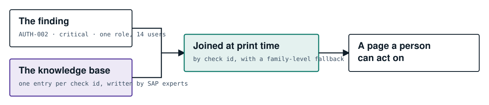

Keeping the words out of the code has three practical effects. The people who write the guidance are SAP specialists, not programmers, and they can improve 673 entries without touching a line of code. The same entry serves the web page, the PDF and the slide deck, so the three cannot drift apart. And when no entry exists yet for a new check, the report falls back to the finding’s own description and a generic remediation — so a missing entry produces a thinner page, never a blank one.

### What good guidance avoids

| Not this | But this |
|---|---|
| “Apply least privilege.” | “In transaction PFCG, open role `Z_BASIS_SUPPORT`, remove the wildcard from the object below, regenerate the profile, and confirm with SU53 that the fourteen affected users retain the access they need for their day job.” |
| “Harden the parameter.” | “Set this profile parameter to 3 in transaction RZ10. It requires a restart to take effect, so schedule it. Confirm afterwards with RSPARAM that the *active* value has changed and not only the stored one.” |
| “Patch the system.” | “SAP Note 2934135 corrects this. It is a kernel-level correction, so plan the downtime. This flaw is on the public actively-exploited list — treat it as urgent rather than routine.” |

> **Take-away from this chapter**
>
>  Advice that cannot be followed without further research is not advice. The system separates what was found from how to fix it, so that each can be produced by the people best placed to produce it, and joins them at the last moment.

## Chapter 21 — Speaking the auditor’s language

> The same weakness has several names depending on who is asking. Translating between those names, automatically, saves an enormous amount of human effort every year.

### The problem of many questionnaires

A large company is asked the same questions repeatedly by different parties in different vocabularies. The information-security certification asks about access control in its own numbering. A government framework asks about the same thing under a different reference. An automotive customer asks under a third. A financial regulator asks under a fourth. A cloud-services audit asks under a fifth.

Underneath, they are frequently asking about the same control — and the company’s evidence is the same in every case. Yet the mapping is usually done by hand, in a spreadsheet, by someone senior, once a year, and it is nobody’s favourite month.

### What the system does

Every finding is associated with the specific clauses of eight frameworks it bears on. One scan therefore produces, without further work, a panel per framework listing which controls are implicated and how many findings sit under each.

| Framework | Who asks |
|---|---|
| **ISO/IEC 27001:2022** | The international information-security standard; the certification most companies hold. |
| **NIST Cybersecurity Framework 2.0** | A widely used way of organising a security programme, common in board reporting. |
| **NIST SP 800-53 Rev 5** | A detailed US control catalogue; frequently required by government-linked customers. |
| **DORA** | European financial-sector regulation on operational resilience. |
| **CIS Controls v8** | A practical, prioritised control set favoured by practitioners. |
| **TISAX / VDA ISA** | The automotive industry’s assessment, required by most vehicle manufacturers of their suppliers. |
| **SOC 2** | The service-organisation report customers request from their vendors. |
| **EU GDPR** | Data-protection obligations, where they bear on system configuration. |

### An unusual restraint worth explaining

One of these frameworks, the European financial regulation, is mapped to *named requirement areas* rather than to article numbers, even though article numbers would look more precise and more impressive on a slide.

The reason is that a reader who sees an article citation will look it up, and will expect the sub-paragraph to say what the citation implies it says. Where a mapping is a matter of professional judgement rather than a direct quotation, claiming article-level precision would be overstating the work. Naming the requirement area is honest about the resolution of the mapping.

> **What this mapping is and is not**
>
>  It is a translation layer that saves an enormous amount of manual cross-referencing. It is *not* a compliance assessment. The system observes configuration in one system; a certification covers an entire management system including policies, training, physical security and supplier governance. There is deliberately no compliance percentage and no maturity score anywhere in the product — chapter [23](#contents) explains why that restraint is structural rather than modest.

**FIG. 21.1 — One finding, eight vocabularies**

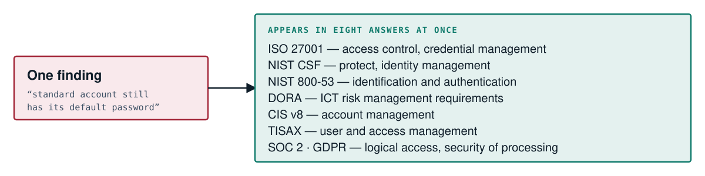

## Chapter 22 — Putting a number on the risk

> Boards do not allocate budget against severity counts. They allocate against money. This chapter explains how the system converts a technical picture into a financial one — and, just as importantly, when it refuses to.

### Why counts fail in the boardroom

“We have 47 critical findings” is a sentence that cannot be acted on at board level. Is 47 good or bad? Is it better than last quarter’s 52? Would spending two million to reduce it be sensible or absurd? The number has no units the board’s other decisions are made in.

Every other risk the board considers — currency, supply chain, litigation, credit — arrives expressed in money, with a probability attached. Security arriving as a count is why it is often discussed last.

### The method

The system uses an established, published method for expressing information risk in financial terms, known by the initials **FAIR**. It is not a proprietary formula. The essential idea is straightforward: rather than guessing a single number, estimate a *range* for how often a loss event might occur and a *range* for how much it would cost, then simulate many thousands of possible years and look at the distribution of outcomes.

**FIG. 22.1 — From findings to a financial range**

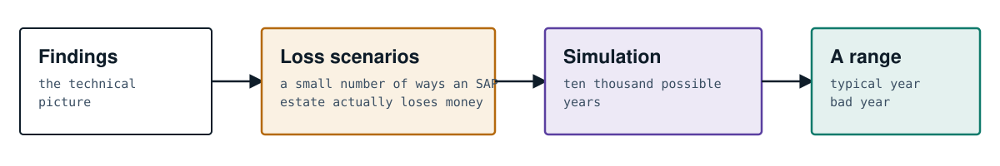

### Three rules that keep it honest

#### 1. A finding is not a risk

It is tempting to attach a cost to each finding and add them up. That would be nonsense: a hundred findings that all enable the same ransomware event do not produce a hundred ransomware events. Instead, findings are treated as *evidence that shifts the estimates* of a small number of scoped loss scenarios. Twenty findings about exposed interfaces make one scenario more likely; they do not create twenty scenarios.

#### 2. The complete set is always used

The financial figure is computed from every finding, never from a filtered view — and the number of findings used is stored beside the figure. Anyone can therefore verify that a display setting did not move the money.

#### 3. Without your figures, no figure is printed

This is the rule that most distinguishes the implementation. The simulation needs organisation-specific inputs: what an hour of downtime costs this business, what a records breach would cost at this scale. Only the customer knows those.

If they are not supplied, the system will still show the *shape* of the analysis using an illustrative reference company — which scenarios dominate, where the leverage is. But it will not present any currency amount as this organisation’s exposure. And that refusal extends to the terminal output, not only the report, on the reasoning that a number printed on a screen is copied into an email exactly as readily as one printed in a document.

> **Why that refusal matters**
>
>  A plausible-looking dollar figure, based on a generic reference company, travels. It gets pasted into a board pack, loses its footnote on the way, and becomes “the number”. Declining to print it is the only reliable way to prevent that.

### What the board actually receives

| Figure | What it answers |
|---|---|
| **Expected annual loss** | In a typical year, what should we expect this exposure to cost? |
| **The one-in-ten bad year** | How bad is a bad year? Usually far more decision-relevant than the average. |
| **Loss-exceedance curve** | The probability of exceeding any given loss — the shape risk professionals expect to see. |
| **Reducible amount** | How much of that exposure would go away if the findings were remediated. This is the number that justifies a budget. |
| **Unattributed count** | How many findings could not be routed to a specific scenario — disclosed rather than hidden. |

> **Take-away from this chapter**
>
>  The system can express the technical picture in the units the board already uses, using a public method, computed from the complete evidence — and it declines to produce a number at all when the inputs that would make it meaningful have not been supplied.

## Chapter 23 — Saying what we cannot see

> This chapter describes a feature whose entire purpose is to prevent the product from appearing better than it is. It is unusual enough to be worth a full explanation.

### The commercial pressure

Buyers of SAP security software often work from a checklist of twelve capability areas that the market has settled on: baselining, access control, identity, violations, custom code, compliance monitoring, patching, transports, suspicious behaviour, event monitoring, interface traffic, and exploit protection.

Presenting findings in those twelve areas is genuinely useful: a buyer with the checklist can match line for line rather than translating. The temptation, obviously, is to show twelve tiles each with a number on it, which reads as twelve capabilities delivered.

### Why that would be a lie

Four of those twelve areas describe *continuous* activities — watching events as they happen, watching traffic between systems, watching user behaviour, blocking exploitation in real time. This product reads a photograph. It does none of those four, and no amount of clever presentation changes that.

A tile showing “Security Event Monitoring: 3” implies the product monitors events. It does not. It can tell you whether the audit log was configured such that it *could* have recorded an answer — a genuinely useful thing, and a completely different thing.

### The solution: two facts, not one

Every domain therefore states two things that are easy to confuse and are never merged:

| Fact | What it answers | Property of |
|---|---|---|
| **Reach** | What this product can *ever* see in this area. | The product. Fixed. Identical for every customer, for ever. |
| **State** | What *this scan* found here: findings, no findings, export not supplied, or not assessed. | This customer, this scan. |

**FIG. 23.1 — The twelve areas, with reach stated on the tile**

**Fully assessed — we see this properly**
  - Baselining and benchmarking
  - Access and authorisation
  - Identity security
  - Violation management
  - Custom code security

**Partly assessed — with the limit named**
  - Compliance monitoring
  - Patch and HotNews
  - Transport security
  - Suspicious user behaviour

**Configuration only — the setting, not the activity**
  - Security event monitoring
  - Interface traffic monitoring

**Not covered**
  - Exploit and 0-day protection
  - This tile prints a dash, never a zero.

*Three rules make the tiles trustworthy. Every finding belongs to exactly one area — a **strict partition**, so the tiles add up to the total and never exceed it. Findings the vocabulary has no word for are listed with the reason, never quietly dropped. And there is no score, no percentage, no maturity rating: we see your findings, not your controls.*

### The dash instead of the zero

The smallest detail on that diagram is the most revealing. In the area the product does not cover at all, the tile shows a dash rather than the number zero.

Zero is a measurement. It says “we looked and found nothing”. A dash says “we did not look”. They are printed identically by almost every dashboard ever built, and the difference between them is precisely the difference between a customer who knows they need another control for that area and a customer who believes they are covered.

> **Take-away from Part V**
>
>  Rank by more than severity, and never let a display filter move a claim (ch. 19). Give people instructions they can follow (ch. 20). Translate once into every audit vocabulary (ch. 21). Express the exposure in money, or refuse to (ch. 22). And state on the face of the product what it cannot see (ch. 23).

---

# Part six · Using it over time

A single scan tells you where you stand. The value compounds when scans are repeated, compared, and wired into the way changes are made. This part covers the outputs, the pass/fail signal, and the mechanism that lets a finding be recognised across months.

1. **24**[Three reports, three readers](#contents)
2. **25**[The traffic light: stopping bad changes](#contents)
3. **26**[The control room](#contents)
4. **27**[How a finding recognises itself](#contents)
5. **28**[The five states, and why the fifth matters](#contents)

## Chapter 24 — Three reports, three readers

> The same scan produces three quite different documents, because the engineer, the auditor and the board are not reading for the same thing and pretending otherwise serves none of them.

**FIG. 24.1 — One scan, three documents**

**Interactive page** — For triage, at a desk
  - a single self-contained file
  - risk score and P1–P4 queue
  - filter and expand as you work
  - full detail on every finding
  - Survives being emailed — there are no companion files to lose.

**Formal document** — For hand-over
  - cover, then the fix-first queue
  - findings grouped by area
  - compliance mapping
  - a page per finding, in order
  - Page numbers, running header, confidentiality banner.

**Slide deck** — For the meeting
  - executive summary
  - priority queue and actions
  - compliance snapshot
  - or a slide per finding
  - Two modes: a short executive deck, or the full 300+ slides.

### Why the fix-first order runs through all three

In each document the findings are ordered by what to do first, not by module or by severity alone. This sounds trivial and is not. A document ordered by subject area invites the reader to work through it in order, which means they spend Tuesday morning on whichever area happens to be alphabetically first. A document ordered fix-first means the reader who gets through only the first three pages has still done the three most valuable things available to them.

### An engineering note worth knowing

All three formats are produced by code written specifically for this product, using nothing but what comes with the programming language itself. There is no third-party document library, no external slide library, no rendering service.

This is more work, and it is a deliberate trade. Every additional library is a component that must be patched, licensed, audited and explained to a customer’s security review. For a security product that is expected to run in restricted environments — sometimes with no internet access whatsoever — having no runtime dependencies at all is a feature customers notice.

### What each reader takes away

| Reader | Format | What they do next |
|---|---|---|
| SAP Basis engineer | Interactive page | Works the P1 list, expanding each finding for the exact steps. |
| Security manager | Formal document | Hands it to the team as the agreed scope of work for the quarter. |
| Internal audit | Formal document | Extracts the compliance mapping and the duty-separation results as evidence. |
| CISO / board | Executive deck | Takes the exposure figure and the reducible amount into a budget conversation. |
| Change pipeline | None — an exit code | Proceeds or stops. Chapter [25](#contents). |

## Chapter 25 — The traffic light: stopping bad changes

> A report tells you what is wrong. A control stops things getting worse. This chapter is about the mode in which the system moves from the first to the second.

### The idea

Changes to SAP travel through a controlled path: a developer makes a change on a development system, it is packaged into a **transport**, and that package is imported into test and then production. It is the SAP equivalent of a release.

In gate mode, the system runs as part of that path and returns one of three answers. Modern release automation understands exactly this convention.

**FIG. 25.1 — Three answers, not two**

**Exit code 0** — Pass
  - Nothing in scope got worse.

**Exit code 1** — Blocked
  - The policy was violated.

**Exit code 2** — Cannot assess
  - Coverage was degraded, so no verdict is claimed.

*The third answer is the one most gates lack, and the reason chapter 13 exists.*

### Four rules, each drawn from a way gates get switched off

Anyone who has worked in a large organisation has seen a quality gate introduced with enthusiasm and disabled within a month. The design here is shaped by the specific ways that happens.

#### Rule 1 — Judge the change, not the backlog

A gate that fails because the system already had 300 findings before this developer touched anything blocks every build from the first day. It will be switched off within a week, and rightly. The gate therefore compares against a recorded baseline: what matters is whether *this change* made things worse.

#### Rule 2 — Judge only what the change touched

The gate can be told which objects the transport actually contains, and will judge only findings on those objects. Otherwise a developer is blocked by a problem in somebody else’s code, which is both unfair and futile.

One detail here shows the general attitude: if the scope file names *nothing*, the gate refuses to run rather than passing. Narrowing a gate to nothing would let every build through while appearing to be enforced — the most dangerous kind of broken control, because it looks fine.

#### Rule 3 — Never block on what the developer cannot fix

Under RISE, some findings belong to SAP. Failing a developer’s build over a setting they have no ability to change teaches them that the gate is arbitrary, and the next thing they learn is how to bypass it. Those findings are excluded from the verdict.

#### Rule 4 — Never fail open

If coverage was degraded, or the policy file could not be read, the answer is “cannot assess”. Not pass. A typo in a configuration file must never silently disarm a control, and a build nobody could check must never look like a build that was checked and found clean.

### How it is adopted

In two steps, and the order matters. First, record where you are today as an accepted baseline — this is not surrender, it is the only way to make rule 1 possible. Then enable the gate on every build. From that moment, the backlog is a separate programme of work and the gate’s only job is to stop it growing.

> **Two sharp edges, stated plainly**
>
>  Asking to write a baseline and to evaluate the gate in the same command writes the baseline and skips the evaluation. That one is still true and is documented rather than discovered.

## Chapter 26 — The control room

> The web application exists for one reason: to answer a question the briefcase cannot. Not “what is wrong” but “are we fixing it”.

**FIG. 26.1 — The whole deployment**

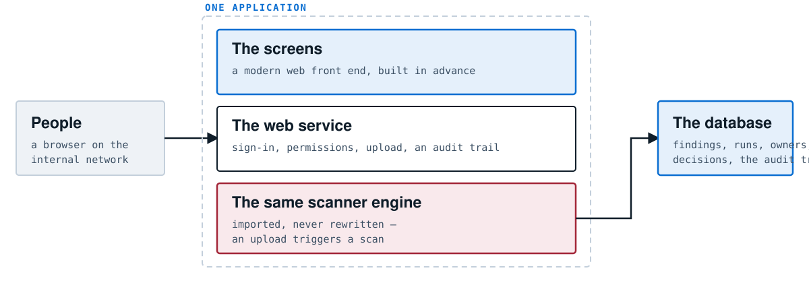

*One application and one database. That is the entire deployment, and keeping it that way is treated as a product commitment rather than an implementation detail.*

### Why “one application and one database” is a design goal

Anyone who has tried to get software approved inside a large organisation knows that the number of moving parts is the single biggest determinant of how long it takes. Each additional service means another thing to host, monitor, patch, back up, firewall and explain.

A deployment that is one application container and one standard database can be installed by a competent team in an afternoon. That is a commercial advantage as much as a technical one, and the project’s own guidance says explicitly that a third service would forfeit it.

### Restraint in what was added

Two deliberate omissions illustrate the discipline. There is no object-relational mapping layer — a common convenience library that sits between application code and the database — because the queries here are few, specific and worth reading. And there is no graph database, even though the product builds a map of related objects; those relationships are stored as ordinary rows in the same database.

The running dependency count is kept to a single digit. It is currently four, and it went *down* by one when the old server-rendered screens were replaced.

### Who can see what

The console has proper access control: users have roles, and access can be scoped so that a team responsible for one system cannot see the findings of another. Everything of consequence is written to an audit log that can only be appended to, never edited — so the record of who accepted which risk is itself trustworthy.

### The console and the interface cannot disagree

The screens and the machine-readable interface are served by the same code path and read from the same query layer. This is the same principle as chapter 8’s shared engine, applied one level down: two implementations of one rule eventually diverge, and when a dashboard and an API report different numbers for the same system, the conversation stops being about security.

## Chapter 27 — How a finding recognises itself

> Everything in Part VI rests on one capability that is easy to overlook: when the same export is scanned again next quarter, the system must recognise which findings are the same ones.

### Why this is not obvious

Each scan is an entirely fresh run over entirely fresh files. Nothing is carried over. The findings are produced in a different order, on a different day, possibly by a slightly different version of the software. There is no identifier travelling with them from last time.

Yet without recognition, none of the following is possible: knowing that a finding has been open for 94 days; noticing that something you fixed in March has come back in July; measuring how long your team takes to fix things; showing an auditor a trend.

### The mechanism: a fingerprint

Each finding is fingerprinted from the concrete things it names — the check identifier plus the specific role, user, parameter, connection or table involved. Two findings with the same fingerprint are the same finding, whenever they were produced.

**FIG. 27.1 — The same file reopened, not a new one each visit**

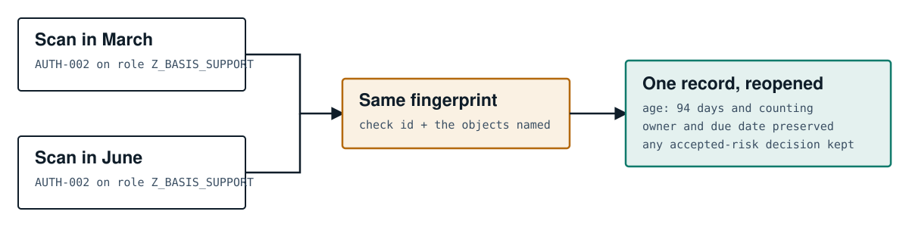

### Why it must be built from the named objects

The alternative would be to identify a finding by its check number alone. That fails immediately: a single check may fire five hundred times in one scan, once per affected role. “AUTH-002” is not a finding; “AUTH-002 on this specific role” is.

Position in the list is worse still — findings are produced in whatever order the modules ran, and one extra finding earlier in the list would shift everything after it, making every record appear to have changed.

This is why chapter 16 insisted that a finding must name concrete objects. It is not only so a human can act on it. It is what makes the finding a durable thing rather than a line in a printout.

### The same fingerprint pays for itself twice

The named objects are also materialised as a map of the estate: roles, users, connections and systems as points, and the relationships between them as links. That map is the groundwork for showing how an attacker could move from one weakness to another — the path from a forgotten account on a development system, through a trusted connection, to production.

The identity mechanism built for tracking turns out to be exactly what a relationship map needs. That is generally a sign a design is right: the same primitive serving two purposes that were not both in view when it was chosen.

## Chapter 28 — The five states, and why the fifth matters

> Between one scan and the next, every finding lands in exactly one of five states. Four of them are obvious. The fifth is the one that makes the other four honest.

**FIG. 28.1 — The five states**

**New**
  - not seen in the previous scan

**Still there**
  - seen before and still present; the clock is running

**Fixed**
  - was present, now absent — *and we could see it*

**Came back**
  - fixed, then returned — same record reopened

**Not seen**
  - this scan could not look here

*Why the fifth cannot be merged into “fixed”: if the export was missing the file a finding depends on, that finding is invisible this time. Calling it “fixed” would report a remediation that never happened — and the trend line would improve because somebody forgot to attach a file. The record stays open, and says why.*

### Absence of evidence

The temptation is obvious. The finding was in last quarter’s list; it is not in this quarter’s; therefore it was fixed. Tidy, and wrong whenever this quarter’s export was thinner than last quarter’s.

The consequence of getting it wrong is not a cosmetic error. It is a metric that improves when people supply *less* information — which, over a few quarters, is a system that quietly teaches its users to look less carefully.

So the state is only “fixed” when the scan could actually observe the area in question. Otherwise the finding stays open and is marked as not examined this time, and the coverage manifest of chapter [13](#contents) explains why.

### Three states alongside these

| State | What it means and why it expires |
|---|---|
| **Accepted risk** | A documented decision to live with something, with a named owner and an *expiry date*. Acceptance without expiry is how a risk register becomes fiction; the expiry brings it back for a fresh decision by people who may now see it differently. |
| **Disputed** | Marked as a false alarm, with a mandatory written reason. The reason matters: it turns a recurring quarterly argument into a recorded decision, and gives the vendor something concrete to improve the check with. |
| **Submitted to the provider** | Raised with SAP under RISE and awaiting them. Neither open nor fixed — because holding the customer’s team accountable for something sitting in someone else’s queue is exactly how a programme loses credibility. |

### What this makes measurable

With states and fingerprints together, a set of numbers becomes available that most organisations cannot produce for their SAP estate at all: how long findings stay open by severity; how many fixes regress; which areas improve and which do not; whether the total is trending down after allowing for coverage changes. Those are management numbers, and they are only trustworthy because the fifth state exists.

> **Take-away from Part VI**
>
>  Three documents for three readers, all in fix-first order (ch. 24). A three-answer gate that judges the change rather than the backlog and never fails open (ch. 25). A minimal two-piece deployment for tracking over time (ch. 26). Fingerprints that let a finding recognise itself across months (ch. 27). And five states, the fifth of which keeps the other four honest (ch. 28).

---

# Part seven · Building, running and extending it

The last part is the most technical, and it is still written for a general reader. It covers what the system is made of, how it is installed, how it protects itself, how it is tested, how it grows, and — at some length — what it cannot do.

1. **29**[What it is made of](#contents)
2. **30**[How it is installed and run](#contents)
3. **31**[Securing the security tool](#contents)
4. **32**[How we know it works](#contents)
5. **33**[Adding a new inspector](#contents)
6. **34**[What it cannot do](#contents)
7. **35**[Where it goes next](#contents)

## Chapter 29 — What it is made of

> Software is assembled from other people’s software. How much of it you take, and how carefully, is one of the more revealing things about a product.

### Dependencies, and why they are a security question

Every piece of software a product uses is called a **dependency**: written by someone else, maintained by someone else, and inheriting all of their mistakes. A modern application commonly has several hundred, most of which the team that wrote it has never read.

This is not paranoia. Several of the most damaging security incidents of recent years came from exactly this — a flaw in a widely used component, present in thousands of products whose authors did not know they had it. For a product that will be installed inside the security perimeter of a critical business system, each dependency is a component the customer must also patch, monitor and approve.

**FIG. 29.1 — What the two halves are built from**

**The briefcase** — 0 · outside components
  - Everything, including the document, PDF and slide-deck writers, is built on what comes with the language.
  - Nothing to patch. Nothing to approve.

**The control room** — 4 · outside components
  - A browser console and a durable store genuinely cannot be built without help.
  - The rule that replaces “none” is “a single digit, and justify each”.

The command-line half has **no** outside dependencies. That includes the report writers: the PDF engine and the PowerPoint engine were written from scratch rather than taken from a library. That is a substantial amount of extra work, undertaken deliberately, and it is why the briefcase mode can run on a locked-down machine with no internet access and no software installation rights.

The server half cannot make that claim — you cannot build a web console and a database-backed store on nothing — so it adopts a different discipline: a single-digit count, currently four, with each one justified. The number went *down* when the old server-rendered screens were replaced by a modern front end built in advance and served as plain files, which removed one component entirely.

### Two things deliberately not adopted

| Not used | Why not |
|---|---|
| A database abstraction layer | A very common convenience that writes database queries for you. The queries here are few and worth reading; hiding them behind a layer makes performance problems hard to see and adds a large dependency for modest gain. |
| A graph database | The system builds a map of related objects, which is the classic case for one. It would also be a second service to deploy, back up and patch — forfeiting the two-piece deployment. The relationships are stored as ordinary rows instead. |

### The language

The system is written in **Python**, chosen because it is readable — a security tool whose logic can be read by an auditor is worth more than one that is fast — and because it is present almost everywhere. It works on versions from 3.8 upward, deliberately including older ones, because regulated environments run older software and a tool that demands the newest version is a tool that cannot be deployed where it is most needed.

## Chapter 30 — How it is installed and run

> Two paragraphs of instructions, essentially. The simplicity is a feature, not an omission from this chapter.

### The briefcase

Copy the program to a machine that has Python. Point it at a folder of export files. Wait. Open the report. There is no installation, no service, nothing left behind, and no network access needed at any point.

```python
# the simplest possible run
python sap_scanner.py --data-dir ./exports --output report.html

# tell it which kind of estate this is (chapter 17)
python sap_scanner.py --data-dir ./exports --deployment-mode rise_pce

# produce all three documents at once (chapter 24)
python sap_scanner.py --data-dir ./exports --output report.html --format all

# run only the modules you care about today (chapter 15)
python sap_scanner.py --data-dir ./exports --modules hanadb hotnews

# use it as a gate in a release pipeline (chapter 25)
python sap_scanner.py --data-dir ./exports --gate --gate-baseline baseline.json
```

Each of those lines corresponds directly to a chapter you have read. The command line is the architecture made visible, which is a reasonable test of whether an architecture is coherent.

### The control room

Two components start together: the application and its database. Then an administrator creates the first account, registers which SAP systems are in scope, and people begin uploading exports.

Registration has a small hierarchy worth knowing: a **landscape** is a customer estate; within it sit **systems** (an SAP system and client) and **tenants** (cloud services such as the HR product, the travel product, the identity service or a cloud account). This is what allows findings to be scoped to the right team and the right owner.

### Air-gapped operation

The control room can also be driven without a browser, from a command on the host, which matters for the most restricted environments. The full function is available with no browser and no external connectivity of any kind.

### What operating it involves

| Task | Frequency and effort |
|---|---|
| Produce an export | Half a day the first time; an hour or two once documented, and much of it schedulable. |
| Run a scan | Minutes. Automatic on upload in the control room. |
| Review and assign findings | The real work. A first scan of a large estate is a programme, not an afternoon. |
| Keep the software current | Replace the files, or rebuild the container. There is no migration ritual. |
| Back it up | One database. Standard practice applies. |

## Chapter 31 — Securing the security tool

> A completed report is an attack plan for the system it describes. That single sentence should govern how this software is treated.

### What is actually sensitive here

The export is sensitive: it names accounts, roles, connections and settings. The report is *more* sensitive, because it does the analysis for the reader. It lists the unlocked standard accounts, the internet-facing services, the missing corrections for actively exploited flaws, and the people with excessive privilege — sorted, helpfully, by exploitability.

> **The practical instruction**
>
>  Treat the export bundle, the reports and the database at the same classification as the SAP system they describe. A scan report left on a shared drive is a more efficient reconnaissance document than an attacker could produce themselves.

### How the product protects itself

| Property | How it is achieved |
|---|---|
| No footprint in SAP | Nothing installed, no account created, nothing written back. Verifiable by inspection because the scanner contains no code that could connect anywhere. |
| Read-only enforced in the plumbing | Where the optional collector is used, the list of permitted operations is checked before a request is even assembled, so a bug cannot reach a destructive operation. |
| No credentials on the command line | There is no password option, because anything typed as part of a command is visible to other users and recorded in shell history. |
| Small supply chain | Zero dependencies in the briefcase; four in the control room. Chapter [29](#contents). |
| Works with no internet | No component requires outbound access. There is no telemetry and no licence call-home. |
| Closed until secured | The first administrator password is generated and printed to the terminal — which means it exists in scrollback and in container logs. The console therefore keeps that account flagged and keeps every data endpoint closed until it is replaced. The control is on the data, not on the page, so it cannot be bypassed by calling the interface directly. |
| Session hygiene | Changing your own password requires the current one even though you are already signed in — a stolen session should not be enough to take an account over permanently. Any password change or reset signs out every other session for that account. |
| Tamper-evident | Role-based access with per-system scoping, and an audit log that can only be appended to. |

### The recovery path

If every administrator account is locked out, the way back in is from the host machine — where whoever runs the container already has direct access to the database anyway. This is worth stating because it is an honest description of the trust model rather than security theatre: pretending the host operator is not already privileged would be a fiction.

## Chapter 32 — How we know it works

> A security tool that is wrong is worse than no tool, because it produces confident false assurance. This chapter is about how correctness is demonstrated rather than asserted.

### The central difficulty

Normally you would test a security scanner against a real system with real problems. Here that is almost impossible: you would need a licensed SAP estate, deliberately misconfigured in 673 distinct ways, and you would need it to stay that way.

### The solution: the whole engine is a pure function

Because the system reads files and produces findings, with no live connection and no hidden state, it can be tested completely without any SAP system at all. The project ships a body of sample data — crafted so that every single check has something to fire on — and the automated tests run every module against it.

**FIG. 32.1 — What the automated tests assert on every change**

✓. **Every module fires** — each check produces a finding against data crafted to trigger it

*Run automatically on five versions of Python, on every single change, before anything is merged.*

### One test worth singling out

The suite checks that a finding’s description is genuinely a piece of text. That sounds absurdly basic until you know what it catches: in this language, a missing comma at the end of a line turns a sentence into a different kind of value entirely. The program does not crash; it produces a report in which one finding’s description is quietly malformed. That is exactly the class of defect that survives human review and reaches a customer, and it is exactly what a machine catches instantly.

### Testing on old versions on purpose

Everything is tested on five versions of the language, including the oldest still in use. It would be easier to require only a recent one. But the environments where this tool matters most — regulated industries, critical infrastructure, restricted networks — are precisely the environments running older software, and a tool that cannot be deployed there has failed regardless of how well it tests elsewhere.

### What testing cannot prove

Honesty requires the boundary. The tests prove the machinery works: modules run, contracts hold, reports render. They cannot prove that a check embodies the right security *judgement*. That a particular permission is genuinely dangerous, or that ninety days is the right dormancy threshold, is a matter of expertise and is validated by review, by field use, and by customers disputing findings — which is one reason the dispute mechanism in chapter [28](#contents) requires a written reason.

## Chapter 33 — Adding a new inspector

> Systems that live for years are the ones that are easy to extend correctly. This chapter walks through what happens when a new subject area is added — useful to engineers, and useful to anyone assessing whether the product can keep up with SAP’s own pace of change.

### Nine steps, in the order the architecture wants them

```python
1 · declare the input, so absence becomes a coverage fact and not silence
   the file → slot table      the DataLoader learns the new filename
   the coverage list          and whether it can be obtained in RISE at all

2 · write the inspector itself
   a new module file          own a check-ID family nobody else uses
                              stand aside quietly if the input is absent
                              flag degraded coverage when you know you
                              could not see everything

3 · wire it in at the one place that knows about every module

4 · write the guidance as content, not code
   the knowledge base         risk narrative + numbered remediation

5 · place it in the twelve-domain vocabulary — exactly one domain

6 · map, quantify, rank
   compliance frameworks      verified control references only
   loss scenarios             or accept the unrouted default
   priority signals           exposure and exploitability, if they apply

7 · craft sample data that makes every new check fire

8 · write the tests that prove the contract

9 · run everything, including the full end-to-end command
```

### Where extensions usually go wrong

| The mistake | Why it matters |
|---|---|
| Reading the filtered list of findings | A new summary panel that reads the list after the severity filter will silently under-report. Chapter [19](#contents). |
| Skipping quietly | A check that stands aside without flagging coverage turns a partial scan into a clean-looking report. Chapter [13](#contents). |
| Naming a specific check in the gate | The gate must react to the general coverage flag, not to a list of known check identifiers. An earlier version did the latter and was armed for one failure mode while disarmed for four others. Chapter [25](#contents). |
| Calculating in the report writer | Report writers render what they are given. A number computed in one document and not the others is how two artefacts from the same scan come to disagree. |
| Splitting one problem into ten | Model the mechanism, report the cause. Chapter [18](#contents). |
| Assuming a fixed number of checks | Several check families are generated at run time from shipped rule lists, so the total is not a constant you can assert on. |
| Writing the check id in a form nothing can read | A positional call and a placeholder-free formatted string are both invisible to a naive reader, and a check nothing can enumerate until it fails corrupts any denominator built from the count. |

### What this tells a buyer

The list above is a good proxy for maintainability. Adding a subject area touches nine well-defined places, none of which requires changing existing checks. That is why the module count has grown from a handful to thirty without the earlier ones being rewritten — and it is a reasonable basis for believing it can track SAP’s own changes.

## Chapter 34 — What it cannot do

> This chapter exists because a document that lists only strengths is marketing. Every constraint below is real, and none of them is hidden elsewhere in the product.

### Fundamental limits — inherent to the approach

| Limit | What follows from it |
|---|---|
| **It is a photograph, not a film** | No continuous monitoring, no real-time alerting, no detection of an attack in progress. Something happening between two scans is invisible. You still need monitoring; this is not it. |
| **It cannot block anything** | It sits nowhere in the path of any user or transaction. It cannot prevent an action, only report that the action was possible. |
| **It sees configuration, not behaviour** | It can tell you a person is *able* to create and pay a supplier. It cannot tell you whether they did. |
| **The export governs everything** | A thin export produces a thin assessment. The coverage manifest makes that visible rather than fixing it. |
| **No runtime protection** | Protection against exploitation as it happens requires an agent inside the system, which is exactly what this design forgoes. The domain tile for it shows a dash. |

### Current limits — true today, addressable

| Limit | Current position |
|---|---|
| The patch catalogue is curated | A verified subset of high-impact corrections since 2020, not the complete SAP corpus. Its size and cut-off are stated, and it can be extended with your own list. |
| Custom-code scanning needs a code export | Without one, that module cannot run. Where SAP’s own code-analysis product is licensed, its results are imported instead and are preferred. |
| Automatic collection is partial | The richest information requires an interface the product declines to use. Every collection run states what it could not reach. |
| The custom-code engine sees ABAP, not everything | Java, JavaScript beyond the UI layer, and generated artefacts are out of scope for the source scanner. Where SAP’s own analysis covers them, those results are imported instead. |

### Things it is sometimes assumed to be

- **It is not a compliance certification.** It maps findings to framework clauses. It does not assess your management system, and it deliberately produces no compliance percentage.
- **It is not a substitute for penetration testing.** It examines configuration against known-bad patterns. It does not attempt to exploit anything, and it will not find a novel flaw in your own business logic.
- **It is not a replacement for SAP’s own governance tooling.** Where a customer runs SAP’s access-control product, this reads its output and adds context; it does not replace the workflow, the approvals or the provisioning.

> **Why this chapter is in the architecture document**
>
>  Because the limits are architectural. “It is a photograph” is not a shortcoming to be fixed in a later release; it is the direct consequence of the decision in chapter [9](#contents) not to touch the SAP system — the same decision that makes the product deployable in RISE at all. The strengths and the limits are the same choice seen from two sides.

## Chapter 35 — Where it goes next

> A brief and deliberately unembellished statement of direction.

### The organising idea

The product is moving from answering “what is wrong” to answering “what would an attacker do, and what is that worth”. The building blocks for that already exist: findings that name concrete objects (chapter [16](#contents)), fingerprints that make those objects durable (chapter [27](#contents)), and a map of relationships between them (chapter [26](#contents)).

### Four directions

| Direction | What it would add |
|---|---|
| **Attack paths** | Showing chains rather than isolated findings: a forgotten account on a development system, a trusted connection, and production at the end of it. Three individually moderate findings can be one critical path, and today they are read separately. |
| **Comparing two scans directly** | Available in the control room today; a straightforward difference between two scans in the briefcase mode is a natural addition for teams not ready to deploy a server. |
| **Broader coverage of SAP’s cloud portfolio** | The tenant model already accommodates the HR, travel and identity products. Depth there will follow the same pattern as the existing modules. |
| **Narrowing the coverage gap** | Every source listed as “not obtainable” is a standing question about whether a legitimate route exists. The export guide improves faster than the code does. |

### What is deliberately not on the list

There is no plan to add an agent inside SAP, no plan to add real-time monitoring, and no plan to sit in the path of user traffic. Each would be a genuinely useful capability, and each would require abandoning the property that makes the product deployable in RISE without a procurement cycle. That trade has been made consciously, and it is not under review.

> **Take-away from Part VII**
>
>  Almost nothing outside the language itself in the briefcase, four components in the control room (ch. 29). A two-piece deployment and a handful of commands (ch. 30). A threat model that starts by admitting the report is the sensitive asset (ch. 31). Tests that run without any SAP system, on five versions of the language, on every change (ch. 32). Nine well-defined steps to extend it (ch. 33). And a candid account of what it will never do (ch. 34) — because those limits are the same decision as its strengths.

---

# Appendices · Reference material

The glossary is the most useful part of this book for a first-time reader; keep a finger in it. The remaining appendices are lookup tables — the modules, what you have to supply, the questions people ask, and a small amount of annotated code for readers who want to see the real thing.

1. **A**[Glossary](#contents)
2. **B**[The thirty modules at a glance](#contents)
3. **C**[What you have to supply](#contents)
4. **D**[Questions people ask](#contents)
5. **E**[Code, annotated](#contents)

## Appendix A — Glossary

> Every technical term used in this book, in plain language. SAP terms and general computing terms are mixed together deliberately, because a reader meeting them for the first time does not know which is which.

| Term | Meaning |
|---|---|
| **ABAP** | SAP’s own programming language, used for both SAP’s code and the customer’s own additions. |
| **Add-on** | Software installed inside an SAP system. Under RISE, installing a third-party one is an Excluded Task. |
| **Agentless** | Requiring nothing to be installed in the system being examined. The defining property of this product. |
| **Authorisation** | A specific permission in SAP — what a person may do to what kind of object. |
| **Baseline (gate)** | A recorded snapshot of accepted findings, so the gate can judge change rather than backlog. |
| **BTP** | SAP Business Technology Platform — SAP’s cloud services for integration, identity and extensions. |
| **Check** | One rule asking one question of the exported information. |
| **CISA KEV** | A US government catalogue of vulnerabilities known to be actively exploited. Presence on it makes a flaw urgent rather than theoretical. |
| **Cloud Connector** | SAP software linking cloud services to on-premise systems. A frequent source of over-broad access. |
| **Coverage manifest** | The record of what a scan could and could not examine. Chapter 13. |
| **CSV** | Comma-separated values — the plain-text format a spreadsheet exports. |
| **Dependency** | Someone else’s software that a product relies on. Each is also something to patch. |
| **Deployment mode** | Which kind of estate an export came from. It changes what counts as compliant. Chapter 17. |
| **Dormant account** | An account not used for a long period but still open. |
| **ECC** | The previous generation of SAP’s business suite. Still widely in use. |
| **ECS** | Enterprise Cloud Services — SAP’s organisation that operates RISE systems. |
| **Excluded Task** | Something outside the standard RISE service, requiring separate agreement. |
| **Export** | The files describing your settings, produced from SAP’s own screens. Chapter 10. |
| **FAIR** | A published method for expressing information risk in financial terms. Chapter 22. |
| **Finding** | One observation: a check identifier, a severity, the objects involved, an owner. Chapter 16. |
| **Fingerprint** | A finding’s durable identity, derived from the objects it names. Chapter 27. |
| **Fiori** | SAP’s modern web interface. |
| **Firefighter** | A controlled way to grant temporary emergency privilege, expected to be reviewed afterwards. |
| **Gate** | Running the scanner as a pass/fail control in a release pipeline. Chapter 25. |
| **HANA** | SAP’s database, underneath S/4HANA. |
| **HotNews** | SAP’s label for its most severe security corrections. |
| **Interface** | A defined way for another system to talk to SAP. |
| **JSON** | A plain-text format that can express nested structure. Used for cloud settings. |
| **Landscape** | A customer’s collection of related SAP systems. |
| **Least privilege** | The principle that everyone should hold only what their job requires. |
| **Module** | One of thirty subject specialists, each owning a family of checks. Chapter 15. |
| **On-premise** | Run by the company on its own infrastructure. |
| **PCE** | Private Cloud Edition — the common RISE variant. |
| **Profile parameter** | A technical setting controlling SAP’s behaviour — password rules, encryption, logging. |
| **RFC** | SAP’s mechanism for one system to call another. Powerful, and a common weak point. |
| **RISE with SAP** | SAP’s offering in which SAP operates the system for the customer. Chapter 2. |
| **Role** | A bundle of authorisations assigned to people. |
| **S/4HANA** | The current generation of SAP’s business suite. |
| **SAP Note** | A published SAP correction, identified by number. |
| **SAP_ALL** | A profile granting essentially every permission. Should be exceptional; frequently is not. |
| **Severity** | How bad a finding would be if exploited: Critical, High, Medium, Low. |
| **Shared responsibility** | The split of security duties between provider and customer in a cloud arrangement. |
| **SIEM** | A system that collects security events from many sources and alerts on patterns. |
| **SNC** | SAP’s mechanism for securing communication between components. |
| **SoD** | Segregation of Duties — keeping dangerous combinations of permission in different hands. Chapter 3. |
| **Taint analysis** | Following untrusted values through a program to see whether they reach somewhere dangerous. Chapter 15. |
| **Tenant** | A customer’s own space within a shared cloud service. |
| **Transport** | A package carrying a change from development through test to production. |
| **Trust boundary** | The line the product will not cross into your systems. Chapter 9. |

## Appendix B — The thirty modules at a glance

> Each row is one specialist inspector. The identifier prefix is what you will see on findings from that module.

| Prefix | Subject | What it examines |
|---|---|---|
| USR- | User accounts | Standard and default accounts, dormant users, account types, expiry. |
| IAM- | Identity management | Role lifecycle, emergency access, review campaigns, cross-system identity, escalation paths. |
| ARA- | Access risk analysis | Duty separation at permission level: **27 risks** plus critical access, with compensating controls. |
| AUTH- | Permission analysis | Dangerous authorisations in role content, attributed to the people who hold them. |
| GRC- | Access governance | The process layer: emergency access review, request approvals, mitigation validity. |
| RG- | Role design | Role build hygiene: proposals unmaintained, profiles never generated, derived roles drifted. |
| S4AUTHZ- | Business roles | The cloud-era authorisation layer: super-admin templates, unrestricted roles, catalogue sprawl. |
| PARAM- | Security settings | **78 technical parameters**: passwords, logon, encryption, logging, gateway. |
| BASELINE- | Baseline settings | Industry-baseline parameters the other modules do not cover. |
| CRYPTO-SNC- | Secure communication | The eighteen related settings as one model, not eighteen comparisons. Chapter 18. |
| …-ECS- | Cloud mandatory config | The non-parameter half of SAP’s mandatory cloud baseline. |
| CRYPTO- | Encryption posture | Transport encryption, certificates, database encryption at rest, key management. |
| HANADB- | Database security | Privileged database users, privilege grants, auditing, database parameters. |
| TRUST- / STDUSR- | System trust | Trusted connections between systems, routing rules, and standard-user status. |
| NET- | Network services | Connections, published services, transport configuration, audit configuration. |
| RISE- | Cloud core | Trust configuration, communication arrangements, published interfaces. |
| BTP- | Cloud attack surface | Cloud Connector, service bindings, destinations, identity service, messaging, integration. |
| INTG- | Integration layer | API policies, document interfaces, web services, webhooks, gateway rules, OAuth clients. |
| FIORI- | The web interface | Catalogue exposure, service-level authorisation, sensitive app visibility. |
| JOBCMD- | Jobs and commands | Operating-system command definitions and scheduled jobs, and whose identity they run under. |
| HOTNEWS- | Missing corrections | Applied corrections against a verified catalogue, including actively exploited flaws. |
| ABAP- | Custom code scan | **135 rules** over your own code, with instruction-level parsing and taint analysis. |
| ATC- | SAP’s own code results | Imports SAP’s code-analysis findings where the customer licenses that product. |
| CODE- | Code and transports | Transport routes, approvals, client settings, modifications to SAP standard. |
| CODE-INV- | Code inventory | The estate picture: object counts, unreferenced code, code of unknown reachability. |
| DPP- | Data protection | Read-access logging, retention, masking in non-production, residency, subject requests. |
| LOG- | Logging and monitoring | Audit log configuration, forwarding to a SIEM, retention, table logging. |
| LREV- | Log review | What the audit log actually recorded over the exported window, as opposed to how it is set up. |
| FIN- | Financial controls | Accounting configuration controls: posting periods, tolerances, dual control, numbering. |
| RES- | Recovery readiness | Backup recency, disaster-recovery test records, recovery objectives. |

> **One honest note about counting**
>
>  The headline “673 checks” needs a footnote. **407** check identifiers are written out individually in the source. A further **266** come from **five families generated at run time** from shipped rule lists — one check per technical parameter (78), one per code rule (135), one per duty-separation risk (27), one per imported code family (10), one per conflicting-duty pair (7). Both numbers are true; stating both is more useful than picking whichever is larger.
>
>  These figures are derived from the code rather than typed here, and the test suite fails if this page and the source ever disagree.

## Appendix C — What you have to supply

> A summary of the export, grouped by what it enables. Every item is optional; each one you omit switches off the checks that need it and is counted in the coverage manifest.

| Group | Roughly what it contains | Enables |
|---|---|---|
| **Core users and roles** | The account list, role assignments, profile assignments, role content down to permission values, user groups. | Accounts, permissions, duty separation, role quality |
| **Technical settings** | The active values of the system’s profile parameters. | Security settings, baseline, encryption, communication |
| **Connections and services** | Connections to other systems, published web services, gateway access rules, routing. | Exposure, system trust, integration |
| **Corrections applied** | The list of SAP notes implemented, with status. | Missing corrections, actively exploited flaws |
| **Database** | Database users, privilege grants, audit configuration, database parameters. | Database security, encryption at rest |
| **Cloud services** | Cloud account configuration, connector settings, destinations, identity service policy, integration content, messaging. | Cloud attack surface, integration layer |
| **Transports and code** | Transport requests and routes, client settings, modification register, code inventory, and optionally a code export. | Change control, custom-code scanning |
| **Logging** | Audit log configuration and, optionally, an extract of the log itself. | Logging configuration, retrospective log review |
| **Governance** | Emergency-access usage, access-review campaigns, mitigating controls, duty-separation rulesets from your own governance product. | Access governance, mitigations |
| **Data protection** | Read-access logging configuration, retention policies, masking, sensitive-field inventory, residency, subject requests. | Data protection and privacy |
| **Finance and resilience** | Posting-period and tolerance configuration, document change rules, backup and disaster-recovery records. | Financial controls, recovery readiness |
| **Your own figures** *(optional)* | What downtime and data loss cost this business. | The financial exposure figure. Without it, no currency amount is printed. |

> **A sensible first scan**
>
>  Do not attempt all of it. Supply the first three groups — users and roles, technical settings, connections and services — plus the list of applied corrections. That is perhaps a third of the catalogue and typically produces the majority of the critical findings, and the coverage manifest will tell you precisely what you traded away.

## Appendix D — Questions people ask

### Does it touch our SAP system?

No. Nothing is installed, no account is created for it, and nothing is written back. The analysis program contains no ability to open a network connection at all. Chapter [9](#contents).

### Does our data leave our premises?

Only if you send it somewhere. The software makes no outbound connections, has no telemetry and no licence check-in, and runs perfectly on a machine with no internet access.

### Does it read our business data — salaries, customers, invoices?

No. The export describes configuration: accounts, roles, settings, connections. There is no check that reads business data and nowhere to put it. Chapter [10](#contents).

### How long does the first assessment take?

Producing the export is the work: half a day to a day. The scan takes minutes. Reviewing the findings is a programme rather than a task, and how long it takes depends entirely on the state of the estate.

### Will it slow down or destabilise our production system?

It cannot. It never runs there. The export is produced by standard SAP reports whose load is comparable to any other reporting, and the analysis happens on a separate machine entirely.

### Can it run in an air-gapped environment?

Yes, in both modes. This was a design requirement, not an accident.

### Do we need to buy anything from SAP to use it?

No. There is no add-on to license, no Excluded Task to negotiate, and no technical user to request. That is the point of the whole design.

### What if we already own an SAP security product?

They are not mutually exclusive, and the tool is deliberately deferential: where you license SAP’s own code analysis, its results are imported rather than re-derived, and where you run SAP’s access governance product, its data is read as input.

### Does it replace our penetration test?

No. It examines configuration against known-bad patterns; a penetration test attempts to exploit. They answer different questions and are commonly done together.

### How do we know the findings are right?

Three ways. The machinery is proven by an automated test suite on every change (chapter [32](#contents)). Each finding names the concrete objects involved, so you can verify it in your own system in minutes. And where you disagree, the dispute is recorded with a written reason rather than argued again next quarter.

### What happens if we only supply half the files?

You get an assessment of half the estate, and the report says so on its face: how many sources you supplied out of how many exist, how many modules ran partially, and how many did not run at all. Chapter [13](#contents).

### Can we use it as a gate on our releases?

Yes, and it is designed for the way gates actually get adopted: it judges the change rather than the backlog, only the objects the change touches, never blocks on something the customer cannot fix, and never passes when it could not assess. Chapter [25](#contents).

### Can it tell us the risk in money?

Yes, using a published method — but only if you supply what downtime and data loss cost your business. Without your figures it will show the shape of the analysis and deliberately print no currency amount. Chapter [22](#contents).

### How is it kept current as SAP changes?

Most of what changes is content rather than code: the correction catalogue, the guidance, the rule lists. Adding a whole new subject area touches nine well-defined places without disturbing existing checks. Chapter [33](#contents).

## Appendix E — Code, annotated

> Three short extracts, for readers who want to see the real thing. Each is followed by a plain explanation. Nothing here is required to understand the book.

### E.1 — How a scan is assembled

This is the shape of the top-level program: the place where all the pieces are wired together.

```python
# 1 — read every export file into one shared body of information
loader = DataLoader(data_dir)
data   = loader.load_all()

# 2 — decide once, in one place, what kind of estate this is
run_ctx = {"deployment_mode": args.deployment_mode,
           "modules": set(run_modules)}

# 3 — run each requested inspector and collect what it reports
all_findings = []
if "users" in run_modules:
    auditor = UserAuthAuditor(data, baseline_overrides, run_ctx)
    all_findings.extend(auditor.run_all_checks())
#   …and the same shape, once per module, for all thirty

# 4 — keep the complete set before any display filter is applied
fair_findings = list(all_findings)
```

Four things in that fragment carry the weight of several chapters. The information is loaded *once* and shared (chapter [12](#contents)). The estate type is decided *once*, so two modules cannot disagree (chapter [17](#contents)). Each module is a small, uniform thing that is asked for its findings and does nothing else (chapter [15](#contents)). And the complete set is preserved before any filtering, so nothing that makes a claim about the estate ever reads a filtered list (chapter [19](#contents)).

### E.2 — Why the corpus is copied

That last line has a comment above it in the real source, and it is unusually direct:

```python
# THE CORPUS AS SCANNED. `--severity` is a DISPLAY option — it decides what
# is listed, not what was found — so everything that makes a claim ABOUT THE
# ESTATE reads this rather than the filtered list below.

fair_findings = list(all_findings)

# now, and only now, filter for display
if args.severity != "ALL":
    all_findings = [f for f in all_findings
                    if severity_rank(f) <= threshold]
```

A comment in capital letters is usually a sign that somebody was bitten. They were: the rule originally protected only the financial figure, and a compliance area containing genuine medium findings displayed a green “nothing found” badge when a reader asked to see only high-severity items. The comment is where it is so that the next person to add a summary panel reads it before they make the same mistake.

### E.3 — Refusing to print a number

The financial quantification, when no customer figures have been supplied:

```python
if loss_figures_supplied:
    print("Annual loss exposure: typical ${:,.0f}  bad year ${:,.0f}"
          .format(typical, bad_year))
else:
    print("Scenario shape computed; NO currency figure is reported "
          "for this organisation because none of its own loss "
          "figures were supplied.")
```

The analysis still runs, and still tells you which scenarios dominate. What it will not do is print a currency amount derived from a generic reference company. The `else` branch exists because a figure on a terminal is copied into an email exactly as readily as one printed in a document — and once copied, it loses its footnote and becomes “the number”. Chapter [22](#contents).

**Provenance and caveat.** This book was written from the repository’s documentation and its top-level program, at [github.com/Krishcalin/SAP-S4HANA-RISE-Security-Scanner](https://github.com/Krishcalin/SAP-S4HANA-RISE-Security-Scanner). Module names, the command-line surface, the pipeline order, the corpus-split rule, the gate rules and the deployment-mode behaviour are taken from the source and documentation. Descriptions of the internal structure of individual inspectors, the exact shape of a finding record, and the illustrative code in Appendix E are reconstructions written to be faithful in substance rather than literal in syntax; verify against the source before quoting them. All diagrams are architectural rather than exhaustive.

The counts this document states — 673 checks, 407 written as literals, 266 generated at run time from 5 rule families, 33 modules, 135 custom-code rules, 27 duty-separation risks, 78 profile parameters and 128 logical sources — are derived from the code by `tests/test_architecture_doc.py`, which fails the build if this page and the source disagree. Edition 1.1 corrected three figures that had drifted from the source.

**Confidential.** This document is not for publication. It describes the internal design, the current limitations and the forward direction of a commercial product; treat it as you would any other confidential product document.

Copyright © 2026 Krishnendu De. All rights reserved. Source-available, not open source — reading and review are permitted; any use requires written permission.
